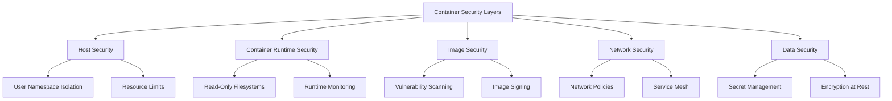

# US-207 Docker Security Implementation - Elite Engineering Training Guide

**Training Module**: US-207 Docker Security Implementation
**Version**: 1.0
**Date**: December 17, 2024
**Audience**: Platform Engineers, DevSecOps Engineers, System Administrators
**Prerequisites**: Docker fundamentals, Linux security basics, CI/CD pipeline knowledge

---

## 🎯 **LEARNING OBJECTIVES**

By the end of this training, engineers will be able to:

1. **Implement** enterprise-grade Docker security controls following CIS Docker Benchmark
2. **Configure** user namespace isolation and read-only filesystems
3. **Integrate** security scanning into CI/CD pipelines
4. **Manage** container vulnerabilities using automated systems
5. **Monitor** runtime security events and respond to incidents
6. **Maintain** compliance with NIST SP 800-190 guidelines

---

## 📚 **MODULE 1: SECURITY ARCHITECTURE OVERVIEW**

### **1.1 Defense-in-Depth Architecture**

The US-207 implementation follows a layered security approach:



### **1.2 Security Components**

| Component                    | Purpose                 | Security Benefit              |
| ---------------------------- | ----------------------- | ----------------------------- |
| **User Namespace Isolation** | Process isolation       | Prevents privilege escalation |
| **Read-Only Filesystems**    | Immutable containers    | Prevents runtime tampering    |
| **CI/CD Security Scanning**  | Vulnerability detection | Proactive security            |
| **Vulnerability Management** | Risk assessment         | Automated remediation         |
| **Resource Limits**          | Resource control        | DoS prevention                |
| **Secret Management**        | Credential security     | Encrypted storage             |
| **Runtime Monitoring**       | Real-time detection     | Incident response             |

---

## 🔧 **MODULE 2: HANDS-ON IMPLEMENTATION**

### **2.1 User Namespace Isolation Setup**

**Step 1: Configure Docker Daemon**

```bash
# Edit /etc/docker/daemon.json
sudo cp docker/security/daemon.json /etc/docker/daemon.json

# Restart Docker daemon
sudo systemctl restart docker
```

**Step 2: Set Up User Namespace Mapping**

```bash
# Copy user namespace files
sudo cp docker/security/subuid /etc/subuid
sudo cp docker/security/subgid /etc/subgid

# Verify mapping
cat /etc/subuid
cat /etc/subgid
```

**Step 3: Validate Implementation**

```bash
# Check user namespace status
docker info | grep "User Namespace"

# Verify container processes
docker run --rm alpine ps aux
```

### **2.2 Read-Only Filesystem Configuration**

**Step 1: Configure Docker Compose**

```yaml
# docker/security/docker-compose.secure.yml
services:
  app:
    image: myapp:latest
    read_only: true
    tmpfs:
      - /tmp:noexec,nosuid,size=100m
      - /var/tmp:noexec,nosuid,size=50m
    volumes:
      - app_logs:/var/log/app:rw
      - app_cache:/var/cache/app:rw
```

**Step 2: Test Read-Only Enforcement**

```bash
# Start container with read-only filesystem
docker-compose -f docker/security/docker-compose.secure.yml up -d

# Test write protection
docker exec container_name touch /test_file
# Should fail with "Read-only file system"
```

### **2.3 CI/CD Security Scanning Integration**

**Step 1: Configure GitHub Actions**

```yaml
# .github/workflows/docker-security-scan.yml
name: Docker Security Scan
on: [push, pull_request]

jobs:
  security-scan:
    runs-on: ubuntu-latest
    steps:
      - uses: actions/checkout@v3

      - name: Run Hadolint
        uses: hadolint/hadolint-action@v3.1.0
        with:
          dockerfile: Dockerfile

      - name: Run Trivy
        uses: aquasecurity/trivy-action@master
        with:
          image-ref: 'myapp:latest'
          format: 'sarif'
          output: 'trivy-results.sarif'
```

**Step 2: Configure Security Thresholds**

```yaml
# Security scanning thresholds
security:
  vulnerability_thresholds:
    critical: 0
    high: 2
    medium: 10
    low: 50
```

---

## 🛡️ **MODULE 3: VULNERABILITY MANAGEMENT**

### **3.1 Automated Vulnerability Management System**

**System Architecture**:

```python
# docker/security/vulnerability-management.py
class VulnerabilityManager:
    def __init__(self):
        self.scanners = ['trivy', 'grype', 'snyk']
        self.database = SQLiteDatabase()

    def scan_image(self, image_name):
        """Scan container image for vulnerabilities"""
        results = []
        for scanner in self.scanners:
            result = self.run_scanner(scanner, image_name)
            results.append(result)
        return self.aggregate_results(results)
```

### **3.2 CVSS Scoring and Risk Assessment**

**Risk Categories**:

| CVSS Score | Risk Level | Action Required          |
| ---------- | ---------- | ------------------------ |
| 9.0 - 10.0 | Critical   | Immediate remediation    |
| 7.0 - 8.9  | High       | Remediate within 7 days  |
| 4.0 - 6.9  | Medium     | Remediate within 30 days |
| 0.1 - 3.9  | Low        | Remediate within 90 days |

### **3.3 Automated Remediation**

**Remediation Workflow**:

```bash
# Automated vulnerability remediation
./docker/security/vulnerability-management.py remediate \
  --image myapp:latest \
  --severity critical,high \
  --auto-fix true
```

---

## 📊 **MODULE 4: MONITORING AND ALERTING**

### **4.1 Runtime Security Monitoring**

**System Components**:

```bash
# Runtime security monitor
./docker/security/runtime-security-monitor.sh monitor

# Real-time alerts
./docker/security/runtime-security-monitor.sh alert-setup
```

### **4.2 Security Dashboard**

**Dashboard Configuration**:

```json
{
  "dashboard": {
    "title": "Docker Security Monitoring",
    "panels": [
      {
        "title": "Security Events",
        "type": "graph",
        "metrics": ["security_events_total", "vulnerability_count"]
      }
    ]
  }
}
```

### **4.3 Incident Response Procedures**

**Response Workflow**:

1. **Detection**: Automated monitoring identifies security event
2. **Assessment**: Threat level evaluation and impact analysis
3. **Containment**: Immediate containment of affected containers
4. **Investigation**: Root cause analysis and evidence collection
5. **Remediation**: Vulnerability patching and system hardening
6. **Recovery**: Service restoration and validation
7. **Lessons Learned**: Documentation and process improvement

---

## 🧪 **MODULE 5: TESTING AND VALIDATION**

### **5.1 Security Testing Framework**

**Test Categories**:

```bash
# Container security tests
pytest tests/security/test_container_security.py

# Vulnerability management tests
pytest tests/security/test_vulnerability_management.py

# Runtime monitoring tests
pytest tests/security/test_runtime_monitoring.py
```

### **5.2 Compliance Validation**

**CIS Docker Benchmark Compliance**:

```bash
# Run CIS Docker Benchmark
docker run --rm --net host --pid host --userns host \
  --cap-add audit_control \
  -v /var/lib:/var/lib \
  -v /var/run/docker.sock:/var/run/docker.sock \
  --label docker_bench_security \
  docker/docker-bench-security
```

### **5.3 Penetration Testing**

**Security Testing Scenarios**:

1. **Container Escape Testing**
2. **Privilege Escalation Attempts**
3. **Network Segmentation Validation**
4. **Secret Exposure Detection**
5. **Resource Exhaustion Testing**

---

## 📖 **MODULE 6: OPERATIONAL PROCEDURES**

### **6.1 Daily Security Operations**

**Daily Checklist**:

- [ ] Review security dashboard for anomalies
- [ ] Check vulnerability scan results
- [ ] Validate backup integrity
- [ ] Review access logs for suspicious activity
- [ ] Verify security monitoring system health

### **6.2 Security Incident Response**

**Incident Response Playbook**:

```bash
# Incident response toolkit
./docker/security/incident-response.sh \
  --incident-type container_breach \
  --container-id <container_id> \
  --severity high
```

### **6.3 Continuous Improvement**

**Security Metrics Review**:

- **Vulnerability Detection Rate**: Target 100% within 24 hours
- **Mean Time to Remediation**: Target < 7 days for high-severity
- **Security Scan Coverage**: Target 100% of container images
- **Compliance Score**: Target > 95% CIS Benchmark compliance

---

## 🎓 **MODULE 7: CERTIFICATION AND ASSESSMENT**

### **7.1 Knowledge Assessment**

**Practical Exercises**:

1. **Configure user namespace isolation for a multi-container application**
2. **Implement read-only filesystems with proper volume mounts**
3. **Set up CI/CD security scanning with custom thresholds**
4. **Create vulnerability management workflow with automated remediation**
5. **Configure runtime security monitoring with custom alerting**

### **7.2 Certification Requirements**

**To achieve US-207 Docker Security Implementation certification**:

- [ ] Complete all training modules
- [ ] Pass hands-on practical assessment (80% minimum)
- [ ] Demonstrate incident response capabilities
- [ ] Implement security monitoring in production environment
- [ ] Document security procedures and runbooks

---

## 📚 **RESOURCES AND REFERENCES**

### **Documentation**

- **Main Implementation Guide**: `docs/security/docker-security-implementation.md`
- **Validation Summary**: `docs/validation/US-207-Docker-Security-Implementation-VALIDATION-SUMMARY.md`
- **Security Configuration Files**: `docker/security/` directory

### **Industry Standards**

- **CIS Docker Benchmark**: [https://www.cisecurity.org/benchmark/docker](https://www.cisecurity.org/benchmark/docker)
- **NIST SP 800-190**: [https://csrc.nist.gov/publications/detail/sp/800-190/final](https://csrc.nist.gov/publications/detail/sp/800-190/final)
- **OWASP Container Security**: [https://owasp.org/www-project-container-security/](https://owasp.org/www-project-container-security/)

### **Tools and Utilities**

- **Hadolint**: Dockerfile linter
- **Trivy**: Vulnerability scanner
- **Grype**: Vulnerability scanner
- **Docker Bench Security**: CIS benchmark tool
- **Falco**: Runtime security monitoring

---

## 🔄 **CONTINUOUS LEARNING**

### **Advanced Topics**

1. **Kubernetes Security**: Extending Docker security to Kubernetes
2. **Service Mesh Security**: Implementing mTLS and network policies
3. **Zero Trust Architecture**: Container-based zero trust implementation
4. **Compliance Automation**: Automated compliance reporting and remediation

### **Updates and Maintenance**

This training guide is updated quarterly to reflect:

- New security threats and vulnerabilities
- Updated compliance requirements
- Enhanced security tools and capabilities
- Lessons learned from security incidents

---

**Training Completion**: Sign and date upon completion

**Engineer Name**: **\*\*\*\***\_\_\_**\*\*\*\*** **Date**: \***\*\_\_\_\*\***

**Trainer/Mentor**: **\*\*\*\***\_\_\_**\*\*\*\*** **Date**: \***\*\_\_\_\*\***

**Certification Level**: ☐ Basic ☐ Intermediate ☐ Advanced ☐ Expert

---

_This training guide is part of the US-207 Docker Security Implementation and follows elite engineering standards for comprehensive security education and certification._
