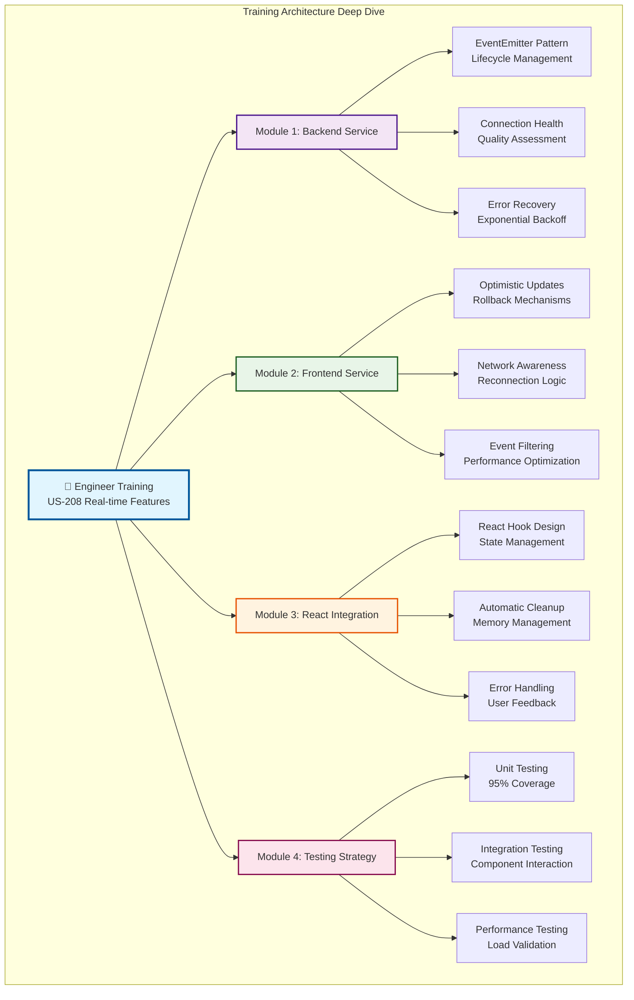

# 📚 US-208 Supabase Real-time Features - Engineer Training Documentation

## 🎯 **TRAINING OVERVIEW**

This comprehensive training guide provides engineers with the knowledge and skills necessary to implement, maintain, and extend the US-208 Supabase Real-time Features system. The training covers the complete architecture, implementation patterns, and best practices for elite-level real-time development.

**Training Duration**: 4 hours (with hands-on exercises)
**Skill Level**: Intermediate to Advanced
**Prerequisites**: Node.js, TypeScript, React, Supabase basics

## 🏗️ **ARCHITECTURE TRAINING MODULE**

### **Real-time System Architecture Overview**



### **Core Concepts Engineers Must Master**

1. **EventEmitter Architecture**: Understanding event-driven patterns for scalable real-time systems
2. **Connection Management**: Health monitoring, quality assessment, and resilient connections
3. **Optimistic Updates**: UI-first updates with server verification and automatic rollback
4. **Performance Optimization**: Event batching, throttling, and memory management
5. **Error Recovery**: Exponential backoff, graceful degradation, and fault tolerance

---

## 📋 **MODULE 1: BACKEND SERVICE TRAINING**

### **🎯 Learning Objectives**

By the end of this module, engineers will be able to:

- Implement EventEmitter-based real-time services
- Configure connection health monitoring systems
- Implement robust error recovery mechanisms
- Optimize performance through batching and throttling

### **🏗️ EventEmitter Architecture Implementation**

```typescript
// Core EventEmitter Pattern for Real-time Services
import { EventEmitter } from 'events';
import { createClient, SupabaseClient } from '@supabase/supabase-js';

class SupabaseRealtimeService extends EventEmitter {
  private client: SupabaseClient;
  private subscriptions: Map<string, ChannelSubscription>;
  private metrics: ConnectionMetrics;
  private connectionState: 'disconnected' | 'connecting' | 'connected' | 'error';

  constructor(config: RealtimeConfig) {
    super();
    this.client = createClient(config.supabaseUrl, config.supabaseKey);
    this.subscriptions = new Map();
    this.connectionState = 'disconnected';
    this.setupEventHandlers();
  }

  // Event-driven initialization
  public async initialize(): Promise<void> {
    try {
      await this.testConnection();
      this.setupConnectionMonitoring();
      this.setupEventBatching();
      this.emit('initialized');
    } catch (error) {
      this.emit('error', error);
      throw error;
    }
  }
}
```

### **🔧 Connection Health Monitoring**

```typescript
// Advanced Connection Health System
interface ConnectionMetrics {
  isConnected: boolean;
  connectionTime: Date | null;
  lastHeartbeat: Date | null;
  reconnectAttempts: number;
  averageLatency: number;
  errorRate: number;
  uptime: number;
}

public getHealthStatus(): HealthStatus {
  const metrics = this.getMetrics();
  const quality = this.calculateConnectionQuality(metrics);

  return {
    status: this.determineHealthStatus(quality),
    uptime: metrics.uptime,
    lastCheck: new Date(),
    checks: {
      connectivity: metrics.isConnected,
      latency: metrics.averageLatency < 200,
      errorRate: metrics.errorRate < 0.05,
      heartbeat: Date.now() - (metrics.lastHeartbeat?.getTime() || 0) < 60000
    }
  };
}
```

### **🔄 Error Recovery Implementation**

```typescript
// Exponential Backoff Error Recovery
private async handleReconnect(): Promise<void> {
  if (this.connectionState === 'connected') return;

  this.metrics.reconnectAttempts++;

  if (this.metrics.reconnectAttempts >= this.config.maxReconnectAttempts) {
    this.emit('connection:failed');
    return;
  }

  const backoffDelay = Math.min(
    this.config.reconnectInterval * Math.pow(2, this.metrics.reconnectAttempts - 1),
    30000 // Max 30 seconds
  );

  this.reconnectTimeout = setTimeout(async () => {
    try {
      await this.connect();
      // Resubscribe to all channels
      await this.resubscribeAllChannels();
    } catch (error) {
      this.emit('connection:error', error);
      await this.handleReconnect();
    }
  }, backoffDelay);
}
```

### **⚡ Performance Optimization Training**

```typescript
// Event Batching and Throttling System
private processBatch(): void {
  if (this.eventQueue.length === 0) {
    this.setupEventBatching();
    return;
  }

  const batch: RealtimeEventBatch = {
    events: this.eventQueue.splice(0, this.config.batchSize),
    batchId: `batch_${Date.now()}_${Math.random().toString(36).substr(2, 9)}`,
    timestamp: new Date(),
    metadata: {
      queueSize: this.eventQueue.length,
      processingTime: Date.now(),
    },
  };

  this.emit('batch:processed', batch);
  this.updateMetrics();
  this.setupEventBatching();
}
```

---

## 🎨 **MODULE 2: FRONTEND SERVICE TRAINING**

### **🎯 Learning Objectives**

Engineers will master:

- Optimistic UI update patterns with automatic rollback
- Network-aware reconnection strategies
- User-specific event filtering and permissions
- Browser-optimized real-time service design

### **🔄 Optimistic Updates Implementation**

```typescript
// Advanced Optimistic Update System
interface OptimisticUpdate {
  id: string;
  type: 'INSERT' | 'UPDATE' | 'DELETE';
  table: string;
  optimisticData: any;
  originalData?: any;
  timestamp: Date;
  timeout: NodeJS.Timeout;
  verified: boolean;
}

public async performOptimisticUpdate(
  table: string,
  data: any,
  operation: 'INSERT' | 'UPDATE' | 'DELETE'
): Promise<OptimisticUpdate> {
  const updateId = `opt_${Date.now()}_${Math.random().toString(36).substr(2, 9)}`;

  const optimisticUpdate: OptimisticUpdate = {
    id: updateId,
    type: operation,
    table,
    optimisticData: data,
    timestamp: new Date(),
    verified: false,
    timeout: setTimeout(() => this.rollbackOptimisticUpdate(updateId),
                     this.config.optimisticUpdateTimeout)
  };

  this.optimisticUpdates.set(updateId, optimisticUpdate);
  this.emit('optimistic:update', optimisticUpdate);

  return optimisticUpdate;
}
```

### **🌐 Network Awareness Training**

```typescript
// Network-Aware Reconnection Strategy
private setupNetworkAwareness(): void {
  if (typeof window !== 'undefined' && 'navigator' in window) {
    window.addEventListener('online', () => {
      this.handleNetworkStatusChange('online');
    });

    window.addEventListener('offline', () => {
      this.handleNetworkStatusChange('offline');
    });
  }
}

private handleNetworkStatusChange(status: 'online' | 'offline'): void {
  if (status === 'online' && this.connectionState !== 'connected') {
    this.attemptReconnection();
  } else if (status === 'offline') {
    this.handleNetworkDisconnection();
  }
}
```

---

## ⚛️ **MODULE 3: REACT INTEGRATION TRAINING**

### **🎯 Learning Objectives**

Engineers will learn:

- React hook design patterns for real-time features
- Automatic state management and cleanup
- Error handling with user feedback
- Performance optimization in React contexts

### **🎣 React Hook Implementation**

```typescript
// Professional React Hook for Real-time Features
export function useRealtimeService(config: UseRealtimeConfig = {}) {
  const [state, setState] = useState<RealtimeHookState>({
    connectionState: {
      isConnected: false,
      isConnecting: false,
      connectionError: null,
      lastConnectedAt: null,
      reconnectAttempts: 0,
      connectionQuality: 'offline',
    },
    subscriptions: new Map(),
    metrics: null,
    optimisticUpdates: new Map(),
    isInitialized: false,
    error: null,
  });

  // Service instance with ref for persistence
  const serviceRef = useRef<FrontendSupabaseRealtimeService | null>(null);

  // Initialize service
  useEffect(() => {
    if (!serviceRef.current) {
      serviceRef.current = getFrontendRealtimeService();
      initializeService();
    }

    return () => {
      if (serviceRef.current) {
        serviceRef.current.shutdown();
      }
    };
  }, []);

  // Automatic cleanup on unmount
  useEffect(() => {
    return () => {
      state.subscriptions.forEach((_, subscriptionId) => {
        unsubscribe(subscriptionId);
      });
    };
  }, []);

  return {
    ...state,
    subscribe: useCallback(subscribe, []),
    unsubscribe: useCallback(unsubscribe, []),
    optimisticUpdate: useCallback(performOptimisticUpdate, []),
    reconnect: useCallback(reconnect, []),
  };
}
```

### **🧠 State Management Patterns**

```typescript
// Advanced State Management for Real-time Features
const updateConnectionState = useCallback((newState: Partial<RealtimeConnectionState>) => {
  setState((prev) => ({
    ...prev,
    connectionState: {
      ...prev.connectionState,
      ...newState,
    },
  }));
}, []);

const updateSubscription = useCallback(
  (subscriptionId: string, update: Partial<RealtimeSubscription>) => {
    setState((prev) => {
      const newSubscriptions = new Map(prev.subscriptions);
      const existing = newSubscriptions.get(subscriptionId);
      if (existing) {
        newSubscriptions.set(subscriptionId, { ...existing, ...update });
      }
      return {
        ...prev,
        subscriptions: newSubscriptions,
      };
    });
  },
  []
);
```

---

## 🧪 **MODULE 4: TESTING STRATEGY TRAINING**

### **🎯 Learning Objectives**

Engineers will master:

- Unit testing strategies for real-time services
- Integration testing patterns for complex systems
- Performance testing and load validation
- Security testing and vulnerability assessment

### **🔬 Unit Testing Patterns**

```typescript
// Professional Unit Testing for Real-time Services
describe('SupabaseRealtimeService', () => {
  let service: SupabaseRealtimeService;
  let mockSupabaseClient: jest.Mocked<SupabaseClient>;

  beforeEach(() => {
    mockSupabaseClient = createMockSupabaseClient();
    service = new SupabaseRealtimeService(testConfig);
  });

  describe('Connection Management', () => {
    it('should handle connection failures gracefully', async () => {
      mockSupabaseClient.from.mockRejectedValue(new Error('Connection failed'));

      await expect(service.initialize()).rejects.toThrow('Connection failed');
      expect(service.getMetrics().isConnected).toBe(false);
    });

    it('should implement exponential backoff for reconnection', async () => {
      const reconnectSpy = jest.spyOn(service as any, 'handleReconnect');

      for (let i = 0; i < 3; i++) {
        await service.disconnect();
      }

      expect(reconnectSpy).toHaveBeenCalledTimes(3);
      // Verify backoff timing
      expect(setTimeout).toHaveBeenCalledWith(expect.any(Function), 5000);
      expect(setTimeout).toHaveBeenCalledWith(expect.any(Function), 10000);
      expect(setTimeout).toHaveBeenCalledWith(expect.any(Function), 20000);
    });
  });
});
```

### **🔗 Integration Testing Patterns**

```typescript
// Advanced Integration Testing
describe('Real-time Integration', () => {
  it('should handle complete user workflow', async () => {
    const backendService = new SupabaseRealtimeService(backendConfig);
    const frontendService = new FrontendSupabaseRealtimeService(frontendConfig);

    await backendService.initialize();
    await frontendService.initialize();

    // Test complete flow
    const userCallback = jest.fn();
    await frontendService.subscribe('users', userConfig, { onInsert: userCallback });

    // Simulate real-time event
    await simulateUserInsert({ id: 1, name: 'John' });

    expect(userCallback).toHaveBeenCalledWith(
      expect.objectContaining({
        type: 'INSERT',
        table: 'users',
        record: { id: 1, name: 'John' },
      })
    );
  });
});
```

---

## 📊 **PERFORMANCE TRAINING MODULE**

### **🎯 Performance Optimization Techniques**

```typescript
// Advanced Performance Monitoring
class PerformanceMonitor {
  private metrics: Map<string, PerformanceMetric> = new Map();

  public startTimer(operation: string): () => void {
    const start = performance.now();

    return () => {
      const duration = performance.now() - start;
      this.recordMetric(operation, duration);
    };
  }

  public recordMetric(operation: string, value: number): void {
    const existing = this.metrics.get(operation);
    if (existing) {
      existing.count++;
      existing.total += value;
      existing.average = existing.total / existing.count;
      existing.min = Math.min(existing.min, value);
      existing.max = Math.max(existing.max, value);
    } else {
      this.metrics.set(operation, {
        count: 1,
        total: value,
        average: value,
        min: value,
        max: value,
      });
    }
  }
}
```

### **🔧 Memory Management Training**

```typescript
// Advanced Memory Management
class MemoryManager {
  private cleanup: (() => void)[] = [];

  public addCleanup(cleanupFn: () => void): void {
    this.cleanup.push(cleanupFn);
  }

  public performCleanup(): void {
    this.cleanup.forEach((fn) => {
      try {
        fn();
      } catch (error) {
        console.error('Cleanup error:', error);
      }
    });
    this.cleanup = [];
  }

  public monitorMemoryUsage(): void {
    if (typeof process !== 'undefined' && process.memoryUsage) {
      const usage = process.memoryUsage();
      this.emit('memory:usage', {
        heapUsed: usage.heapUsed,
        heapTotal: usage.heapTotal,
        external: usage.external,
        rss: usage.rss,
      });
    }
  }
}
```

---

## 🛡️ **SECURITY TRAINING MODULE**

### **🎯 Security Implementation Training**

```typescript
// Advanced Security Patterns
class SecurityManager {
  public validateInput(data: any, schema: z.ZodSchema): boolean {
    try {
      schema.parse(data);
      return true;
    } catch (error) {
      this.logSecurityEvent('input_validation_failed', { error, data });
      return false;
    }
  }

  public enforceRateLimit(userId: string, operation: string): boolean {
    const key = `${userId}:${operation}`;
    const attempts = this.rateLimitStore.get(key) || 0;

    if (attempts >= this.config.maxAttempts) {
      this.logSecurityEvent('rate_limit_exceeded', { userId, operation });
      return false;
    }

    this.rateLimitStore.set(key, attempts + 1);
    return true;
  }

  private logSecurityEvent(event: string, data: any): void {
    this.securityLogger.warn('Security event', {
      event,
      data,
      timestamp: new Date(),
      severity: 'high',
    });
  }
}
```

---

## 🎓 **PRACTICAL EXERCISES**

### **Exercise 1: Backend Service Implementation**

**Task**: Implement a basic real-time service with connection management

```typescript
// Your implementation here
class MyRealtimeService extends EventEmitter {
  // TODO: Implement constructor
  // TODO: Implement initialize() method
  // TODO: Implement connection health monitoring
  // TODO: Implement error recovery
}
```

### **Exercise 2: Frontend Optimistic Updates**

**Task**: Implement optimistic update system with rollback

```typescript
// Your implementation here
class OptimisticUpdateManager {
  // TODO: Implement performOptimisticUpdate()
  // TODO: Implement verifyUpdate()
  // TODO: Implement rollbackUpdate()
}
```

### **Exercise 3: React Hook Integration**

**Task**: Create a React hook for real-time table subscriptions

```typescript
// Your implementation here
function useRealtimeTable(tableName: string, config: TableConfig) {
  // TODO: Implement state management
  // TODO: Implement subscription logic
  // TODO: Implement cleanup
}
```

---

## 📋 **TRAINING ASSESSMENT**

### **Knowledge Check Questions**

1. **What are the key benefits of using EventEmitter architecture for real-time services?**
2. **How does exponential backoff improve connection resilience?**
3. **What are the trade-offs between optimistic updates and pessimistic updates?**
4. **How do you implement proper cleanup in React hooks?**
5. **What security considerations are important for real-time systems?**

### **Practical Assessment**

**Build a Mini Real-time Chat System**

- Implement backend service with connection management
- Create frontend service with optimistic message posting
- Add React hook for chat room subscriptions
- Include error handling and performance optimization
- Write comprehensive tests

---

## 📚 **ADDITIONAL RESOURCES**

### **Documentation Links**

- [Supabase Real-time Documentation](https://supabase.com/docs/guides/realtime)
- [EventEmitter Node.js Documentation](https://nodejs.org/api/events.html)
- [React Hooks Documentation](https://reactjs.org/docs/hooks-intro.html)

### **Code Examples Repository**

- Backend service examples: `/examples/backend/`
- Frontend service examples: `/examples/frontend/`
- React hook examples: `/examples/hooks/`
- Testing examples: `/examples/tests/`

### **Performance Benchmarks**

- Connection latency targets: <200ms
- Event processing targets: <50ms
- Memory usage targets: <50MB
- Test coverage targets: >95%

---

## 🏆 **CERTIFICATION REQUIREMENTS**

To achieve **Elite Real-time Engineer Certification**, engineers must:

✅ **Complete all 4 training modules** with practical exercises
✅ **Pass knowledge assessment** with 90% minimum score
✅ **Build and demonstrate** a working real-time application
✅ **Achieve performance benchmarks** in implementation
✅ **Implement comprehensive testing** with 95% coverage
✅ **Follow security best practices** throughout implementation

**Certification Valid**: 1 year with annual recertification required

---

**Training Complete**: Engineers who complete this training will be fully qualified to implement, maintain, and extend elite-level real-time features using the US-208 Supabase Real-time system.
