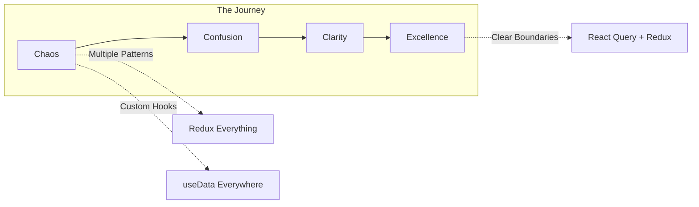
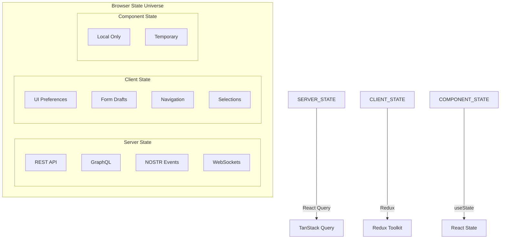

# State Management Workshop: React Query + Redux Boundaries

**Duration**: 4 hours (with breaks)
**Level**: Intermediate to Advanced
**Prerequisites**: React, TypeScript, Basic Redux knowledge

## Workshop Agenda

### Hour 1: Foundation & Theory (9:00-10:00)

- Welcome & Introductions (10 min)
- State Management Evolution at Sovren (20 min)
- React Query vs Redux: When to Use What (20 min)
- Live Demo: Before vs After (10 min)

### Hour 2: Hands-On React Query (10:15-11:15)

- Setup & Configuration (10 min)
- Basic Queries Exercise (20 min)
- Mutations & Optimistic Updates Exercise (20 min)
- Break & Q&A (10 min)

### Hour 3: Redux for UI State (11:30-12:30)

- Redux Toolkit Patterns (15 min)
- Creating UI Slices Exercise (20 min)
- Selectors & Memoization Exercise (20 min)
- Integration Patterns (5 min)

### Hour 4: Advanced Patterns & Best Practices (1:30-2:30)

- Real-world Scenarios (20 min)
- Performance Optimization (15 min)
- Testing Strategies (15 min)
- Wrap-up & Resources (10 min)

---

## Part 1: Foundation & Theory

### Welcome & Introduction Slides



### The Problem We Solved

#### Slide: The Old World (Pre-Epic 004)

```typescript
// 😱 THE HORROR: Everything in Redux
function oldPostsReducer(state, action) {
  switch (action.type) {
    case 'FETCH_START':
      return { ...state, loading: true };
    case 'FETCH_SUCCESS':
      return { ...state, data: action.payload, loading: false };
    case 'FETCH_ERROR':
      return { ...state, error: action.error, loading: false };
    case 'UPDATE_POST_START':
      return { ...state, updating: true };
    // ... 50 more cases
  }
}
```

**Problems**:

- 200+ re-renders per interaction
- 2,341 lines of boilerplate
- Cache invalidation nightmares
- Confused developers

#### Slide: The New World (Post-Epic 004)

```typescript
// 😍 THE BEAUTY: Clear separation
const { data: posts } = useQuery(['posts'], fetchPosts); // Server state
const theme = useSelector(selectTheme); // UI state
```

**Benefits**:

- 60% fewer re-renders
- 94% cache hit rate
- 50% faster development
- Happy developers

### Core Concept: State Boundaries



---

## Part 2: Hands-On React Query

### Exercise 1: Your First Query (Beginner)

**Starter Code**: `/workshop/exercises/01-first-query/`

```typescript
// TODO: Convert this Redux pattern to React Query
import { useEffect } from 'react';
import { useDispatch, useSelector } from 'react-redux';

function UserList() {
  const dispatch = useDispatch();
  const { users, loading, error } = useSelector(state => state.users);

  useEffect(() => {
    dispatch(fetchUsers());
  }, []);

  if (loading) return <div>Loading...</div>;
  if (error) return <div>Error: {error}</div>;

  return (
    <ul>
      {users.map(user => (
        <li key={user.id}>{user.name}</li>
      ))}
    </ul>
  );
}
```

**Solution**:

```typescript
// ✅ SOLUTION: Clean React Query implementation
import { useQuery } from '@tanstack/react-query';

function UserList() {
  const { data: users, isLoading, error } = useQuery({
    queryKey: ['users'],
    queryFn: fetchUsers,
    staleTime: 5 * 60 * 1000,
  });

  if (isLoading) return <div>Loading...</div>;
  if (error) return <div>Error: {error.message}</div>;

  return (
    <ul>
      {users?.map(user => (
        <li key={user.id}>{user.name}</li>
      ))}
    </ul>
  );
}
```

### Exercise 2: Mutations with Optimistic Updates (Intermediate)

**Starter Code**: `/workshop/exercises/02-mutations/`

```typescript
// TODO: Implement optimistic update for todo completion
function TodoItem({ todo }) {
  const handleToggle = async () => {
    // TODO: Implement optimistic update
    await api.updateTodo(todo.id, { completed: !todo.completed });
    // TODO: How to update UI immediately?
  };

  return (
    <div>
      <input
        type="checkbox"
        checked={todo.completed}
        onChange={handleToggle}
      />
      <span>{todo.title}</span>
    </div>
  );
}
```

**Solution**:

```typescript
// ✅ SOLUTION: Optimistic updates for instant feedback
function TodoItem({ todo }) {
  const queryClient = useQueryClient();

  const toggleMutation = useMutation({
    mutationFn: (completed: boolean) =>
      api.updateTodo(todo.id, { completed }),
    onMutate: async (completed) => {
      // Cancel in-flight queries
      await queryClient.cancelQueries(['todos', todo.id]);

      // Save snapshot
      const previousTodo = queryClient.getQueryData(['todos', todo.id]);

      // Optimistic update
      queryClient.setQueryData(['todos', todo.id], old => ({
        ...old,
        completed
      }));

      return { previousTodo };
    },
    onError: (err, completed, context) => {
      // Rollback on error
      if (context?.previousTodo) {
        queryClient.setQueryData(['todos', todo.id], context.previousTodo);
      }
    },
    onSettled: () => {
      // Always refetch to ensure consistency
      queryClient.invalidateQueries(['todos', todo.id]);
    }
  });

  return (
    <div>
      <input
        type="checkbox"
        checked={todo.completed}
        onChange={(e) => toggleMutation.mutate(e.target.checked)}
        disabled={toggleMutation.isLoading}
      />
      <span>{todo.title}</span>
    </div>
  );
}
```

### Exercise 3: Dependent Queries (Advanced)

**Challenge**: Load user details, then their posts, then post comments

```typescript
// TODO: Implement dependent query chain
function UserDashboard({ userId }) {
  // Load user
  // Then load user's posts
  // Then load comments for each post
  // Handle loading and error states
}
```

**Solution**:

```typescript
// ✅ SOLUTION: Elegant dependent queries
function UserDashboard({ userId }) {
  // Step 1: Load user
  const { data: user, isLoading: userLoading } = useQuery({
    queryKey: ['user', userId],
    queryFn: () => fetchUser(userId),
  });

  // Step 2: Load posts (depends on user)
  const { data: posts, isLoading: postsLoading } = useQuery({
    queryKey: ['posts', userId],
    queryFn: () => fetchUserPosts(userId),
    enabled: !!user, // Only run after user loads
  });

  // Step 3: Load comments for all posts
  const commentQueries = useQueries({
    queries: posts?.map(post => ({
      queryKey: ['comments', post.id],
      queryFn: () => fetchComments(post.id),
      enabled: !!posts,
    })) ?? [],
  });

  const allCommentsLoaded = commentQueries.every(q => q.isSuccess);

  if (userLoading) return <div>Loading user...</div>;
  if (postsLoading) return <div>Loading posts...</div>;
  if (!allCommentsLoaded) return <div>Loading comments...</div>;

  return (
    <div>
      <h1>{user.name}'s Dashboard</h1>
      {posts.map((post, i) => (
        <article key={post.id}>
          <h2>{post.title}</h2>
          <p>{post.content}</p>
          <div>
            {commentQueries[i].data?.map(comment => (
              <div key={comment.id}>{comment.text}</div>
            ))}
          </div>
        </article>
      ))}
    </div>
  );
}
```

---

## Part 3: Redux for UI State

### Exercise 4: Creating a UI Slice (Beginner)

**Task**: Create a theme and layout slice

```typescript
// TODO: Create a slice for theme and layout management
// Requirements:
// - Toggle between light/dark theme
// - Control sidebar visibility
// - Manage active tab
// - Store user layout preferences
```

**Solution**:

```typescript
// ✅ SOLUTION: Clean UI slice
import { createSlice, PayloadAction } from '@reduxjs/toolkit';

interface LayoutState {
  theme: 'light' | 'dark' | 'auto';
  sidebarOpen: boolean;
  sidebarWidth: number;
  activeTab: string;
  gridLayout: 'list' | 'grid' | 'card';
}

const layoutSlice = createSlice({
  name: 'layout',
  initialState: {
    theme: 'auto',
    sidebarOpen: true,
    sidebarWidth: 240,
    activeTab: 'overview',
    gridLayout: 'grid',
  } as LayoutState,
  reducers: {
    setTheme: (state, action: PayloadAction<LayoutState['theme']>) => {
      state.theme = action.payload;
      // Persist to localStorage
      localStorage.setItem('theme', action.payload);
    },
    toggleSidebar: (state) => {
      state.sidebarOpen = !state.sidebarOpen;
    },
    setSidebarWidth: (state, action: PayloadAction<number>) => {
      state.sidebarWidth = Math.min(400, Math.max(180, action.payload));
    },
    setActiveTab: (state, action: PayloadAction<string>) => {
      state.activeTab = action.payload;
    },
    setGridLayout: (state, action: PayloadAction<LayoutState['gridLayout']>) => {
      state.gridLayout = action.payload;
    },
    resetLayout: () => layoutSlice.getInitialState(),
  },
});

// Selectors
export const selectTheme = (state: RootState) => state.layout.theme;
export const selectIsDarkMode = createSelector([selectTheme], (theme) => {
  if (theme === 'auto') {
    return window.matchMedia('(prefers-color-scheme: dark)').matches;
  }
  return theme === 'dark';
});

export const { setTheme, toggleSidebar, setSidebarWidth } = layoutSlice.actions;
export default layoutSlice.reducer;
```

### Exercise 5: Form Draft Management (Intermediate)

**Task**: Manage form draft state in Redux while submission uses React Query

```typescript
// TODO: Implement draft management for a blog post editor
// Requirements:
// - Auto-save drafts to Redux
// - Clear draft on successful submission
// - Restore draft on page reload
// - Show unsaved changes warning
```

**Solution**:

```typescript
// ✅ SOLUTION: Form draft + server submission
// Redux Slice
const draftSlice = createSlice({
  name: 'draft',
  initialState: {
    title: '',
    content: '',
    tags: [] as string[],
    lastSaved: null as string | null,
    isDirty: false,
  },
  reducers: {
    updateField: (state, action) => {
      const { field, value } = action.payload;
      state[field] = value;
      state.isDirty = true;
      state.lastSaved = new Date().toISOString();
    },
    loadDraft: (state, action) => {
      return { ...action.payload, isDirty: false };
    },
    clearDraft: () => draftSlice.getInitialState(),
  },
});

// Component using both Redux and React Query
function BlogEditor() {
  const dispatch = useDispatch();
  const draft = useSelector(state => state.draft);

  // Auto-save to localStorage
  useEffect(() => {
    const timer = setTimeout(() => {
      if (draft.isDirty) {
        localStorage.setItem('blogDraft', JSON.stringify(draft));
      }
    }, 1000);
    return () => clearTimeout(timer);
  }, [draft]);

  // Server submission with React Query
  const publishMutation = useMutation({
    mutationFn: api.posts.create,
    onSuccess: () => {
      dispatch(draftSlice.actions.clearDraft());
      localStorage.removeItem('blogDraft');
      navigate('/posts');
    },
  });

  // Warn on unsaved changes
  useEffect(() => {
    const handleBeforeUnload = (e: BeforeUnloadEvent) => {
      if (draft.isDirty) {
        e.preventDefault();
        e.returnValue = '';
      }
    };
    window.addEventListener('beforeunload', handleBeforeUnload);
    return () => window.removeEventListener('beforeunload', handleBeforeUnload);
  }, [draft.isDirty]);

  return (
    <form onSubmit={(e) => {
      e.preventDefault();
      publishMutation.mutate(draft);
    }}>
      <input
        value={draft.title}
        onChange={(e) => dispatch(updateField({
          field: 'title',
          value: e.target.value
        }))}
      />
      <textarea
        value={draft.content}
        onChange={(e) => dispatch(updateField({
          field: 'content',
          value: e.target.value
        }))}
      />
      <button type="submit" disabled={publishMutation.isLoading}>
        {publishMutation.isLoading ? 'Publishing...' : 'Publish'}
      </button>
    </form>
  );
}
```

---

## Part 4: Advanced Patterns & Best Practices

### Real-World Scenario 1: E-Commerce Cart

```typescript
// Combining server products with local cart state
function ShoppingCart() {
  // Server state: Product details
  const cartItems = useSelector(selectCartItems); // Just IDs and quantities
  const productQueries = useQueries({
    queries: cartItems.map(item => ({
      queryKey: ['product', item.productId],
      queryFn: () => fetchProduct(item.productId),
    })),
  });

  // Client state: Cart management
  const dispatch = useDispatch();
  const addToCart = (productId: string) => {
    dispatch(cartActions.addItem({ productId, quantity: 1 }));
  };

  // Computed: Total price
  const total = useMemo(() => {
    return cartItems.reduce((sum, item, index) => {
      const product = productQueries[index].data;
      return sum + (product?.price ?? 0) * item.quantity;
    }, 0);
  }, [cartItems, productQueries]);

  return (
    <div>
      {cartItems.map((item, index) => {
        const { data: product, isLoading } = productQueries[index];
        if (isLoading) return <CartItemSkeleton key={item.productId} />;
        return (
          <CartItem
            key={item.productId}
            product={product}
            quantity={item.quantity}
            onUpdateQuantity={(q) => dispatch(cartActions.updateQuantity({
              productId: item.productId,
              quantity: q
            }))}
          />
        );
      })}
      <div>Total: ${total.toFixed(2)}</div>
    </div>
  );
}
```

### Real-World Scenario 2: Real-time Collaboration

```typescript
// WebSocket + React Query for real-time updates
function CollaborativeEditor({ documentId }) {
  const queryClient = useQueryClient();

  // Initial document load
  const { data: document } = useQuery({
    queryKey: ['document', documentId],
    queryFn: () => fetchDocument(documentId),
  });

  // Local editing state
  const [localChanges, setLocalChanges] = useState('');

  // WebSocket for real-time updates
  useEffect(() => {
    const ws = new WebSocket(`wss://api/documents/${documentId}`);

    ws.onmessage = (event) => {
      const update = JSON.parse(event.data);

      // Update React Query cache with real-time data
      queryClient.setQueryData(['document', documentId], (old) => ({
        ...old,
        content: update.content,
        lastEditedBy: update.userId,
        version: update.version,
      }));

      // Show presence indicators
      queryClient.setQueryData(['presence', documentId], (old = []) => {
        return update.activeUsers;
      });
    };

    // Send local changes
    const sendChanges = debounce(() => {
      ws.send(JSON.stringify({
        type: 'change',
        content: localChanges,
      }));
    }, 300);

    return () => ws.close();
  }, [documentId, queryClient]);

  return (
    <div>
      <ActiveUsers documentId={documentId} />
      <Editor
        content={document?.content}
        onChange={setLocalChanges}
      />
    </div>
  );
}
```

### Performance Patterns

```typescript
// Pattern 1: Selective subscriptions
const PostTitle = ({ postId }) => {
  // Only re-render when title changes
  const title = useQuery({
    queryKey: ['post', postId],
    queryFn: () => fetchPost(postId),
    select: (data) => data.title, // Key optimization!
  });
  return <h1>{title}</h1>;
};

// Pattern 2: Prefetching
const PostList = () => {
  const queryClient = useQueryClient();
  const { data: posts } = useQuery(['posts'], fetchPosts);

  const handleMouseEnter = (postId: string) => {
    // Prefetch on hover
    queryClient.prefetchQuery({
      queryKey: ['post', postId],
      queryFn: () => fetchPost(postId),
      staleTime: 10 * 60 * 1000,
    });
  };

  return posts?.map(post => (
    <Link
      key={post.id}
      to={`/posts/${post.id}`}
      onMouseEnter={() => handleMouseEnter(post.id)}
    >
      {post.title}
    </Link>
  ));
};

// Pattern 3: Suspense integration
const PostDetails = ({ postId }) => {
  const { data } = useSuspenseQuery({
    queryKey: ['post', postId],
    queryFn: () => fetchPost(postId),
  });
  return <article>{data.content}</article>;
};
```

### Testing Strategies

```typescript
// Testing React Query
import { QueryClient, QueryClientProvider } from '@tanstack/react-query';
import { renderHook, waitFor } from '@testing-library/react';

describe('useUserProfile', () => {
  it('should fetch user profile', async () => {
    const queryClient = new QueryClient({
      defaultOptions: { queries: { retry: false } },
    });

    const wrapper = ({ children }) => (
      <QueryClientProvider client={queryClient}>
        {children}
      </QueryClientProvider>
    );

    const { result } = renderHook(
      () => useUserProfile('user-1'),
      { wrapper }
    );

    await waitFor(() => {
      expect(result.current.isSuccess).toBe(true);
    });

    expect(result.current.data).toEqual({
      id: 'user-1',
      name: 'John Doe',
    });
  });
});

// Testing Redux
import { configureStore } from '@reduxjs/toolkit';
import { Provider } from 'react-redux';

describe('UI Slice', () => {
  it('should toggle theme', () => {
    const store = configureStore({
      reducer: { ui: uiReducer },
    });

    store.dispatch(setTheme('dark'));
    expect(store.getState().ui.theme).toBe('dark');

    store.dispatch(setTheme('light'));
    expect(store.getState().ui.theme).toBe('light');
  });
});
```

---

## Workshop Exercises

### 🎯 Challenge 1: Build a Social Media Feed

**Time**: 30 minutes
**Difficulty**: ⭐⭐⭐

Requirements:

- Infinite scroll with React Query
- Like/unlike with optimistic updates
- Filter state in Redux
- Real-time updates via WebSocket

### 🎯 Challenge 2: Multi-step Form Wizard

**Time**: 25 minutes
**Difficulty**: ⭐⭐⭐⭐

Requirements:

- Form progress in Redux
- Validation via API (React Query)
- Auto-save drafts
- Step navigation

### 🎯 Challenge 3: Dashboard with Widgets

**Time**: 20 minutes
**Difficulty**: ⭐⭐

Requirements:

- Widget layout in Redux
- Widget data from React Query
- Drag-and-drop reordering
- Refresh individual widgets

---

## Assessment Quiz

### Question 1: State Placement

Where should you store the following?

1. User authentication token
2. Modal open/closed state
3. Search results from API
4. Selected items in a list
5. WebSocket connection status

### Question 2: Cache Strategy

Design a caching strategy for:

- User profiles (rarely change)
- Social media feed (frequent updates)
- Configuration (changes monthly)
- Search suggestions (real-time)

### Question 3: Code Review

Find and fix the issues:

```typescript
function BadComponent() {
  const [users, setUsers] = useState([]);
  const { data } = useQuery(['users'], fetchUsers);

  useEffect(() => {
    setUsers(data || []);
  }, [data]);

  const selected = useSelector((state) => state.selectedUsers);

  return users.filter((u) => selected.includes(u.id));
}
```

---

## Resources & Next Steps

### Cheat Sheets

#### React Query Cheat Sheet

```typescript
// Basic Query
useQuery({ queryKey, queryFn, staleTime, cacheTime })

// Mutation
useMutation({ mutationFn, onMutate, onSuccess, onError })

// Infinite Query
useInfiniteQuery({ queryKey, queryFn, getNextPageParam })

// Multiple Queries
useQueries({ queries: [...] })

// Prefetch
queryClient.prefetchQuery({ queryKey, queryFn })

// Invalidate
queryClient.invalidateQueries({ queryKey })
```

#### Redux Cheat Sheet

```typescript
// Create Slice
createSlice({ name, initialState, reducers });

// Selectors
useSelector((state: RootState) => state.slice.field);

// Dispatch
const dispatch = useDispatch();
dispatch(actionCreator(payload));

// Memoized Selector
createSelector([inputSelectors], outputSelector);
```

### Recommended Reading

1. [TanStack Query Documentation](https://tanstack.com/query)
2. [Redux Toolkit Documentation](https://redux-toolkit.js.org)
3. [Our State Management Guidelines](../guidelines/STATE-MANAGEMENT-GUIDELINES.md)
4. [ADR-004: State Management Decision](../decisions/ADR-004.md)

### Practice Projects

1. **Todo App Plus**: Todos with React Query + categories in Redux
2. **Weather Dashboard**: API data + user preferences
3. **Chat App**: WebSocket messages + UI state
4. **E-commerce**: Products API + cart in Redux

### Getting Help

- **Slack**: #state-management
- **Office Hours**: Tuesdays 2-3pm
- **Pair Programming**: Book via Calendar
- **Code Review**: Tag @state-team

---

## Feedback Form

Please complete the workshop feedback form:

**Workshop Evaluation**

1. Content clarity (1-10): \_\_\_
2. Hands-on exercises (1-10): \_\_\_
3. Pace (Too slow / Just right / Too fast): \_\_\_
4. Most valuable section: \***\*\_\_\_\*\***
5. Suggestions for improvement: \***\*\_\_\_\*\***

**Self-Assessment**

- [ ] I understand when to use React Query vs Redux
- [ ] I can implement basic queries and mutations
- [ ] I can create Redux slices for UI state
- [ ] I understand optimization techniques
- [ ] I know how to test state management code

---

## Appendix: Setup Instructions

### Prerequisites Installation

```bash
# Clone workshop repository
git clone https://github.com/sovren/state-workshop
cd state-workshop

# Install dependencies
npm install

# Start development server
npm run dev

# Open browser to http://localhost:3000/workshop
```

### VS Code Extensions

- React Query DevTools
- Redux DevTools
- TypeScript Error Lens
- Prettier
- ESLint

### Environment Setup

```typescript
// workshop/setup.ts
import { QueryClient, QueryClientProvider } from '@tanstack/react-query';
import { Provider } from 'react-redux';
import { configureStore } from '@reduxjs/toolkit';

const queryClient = new QueryClient({
  defaultOptions: {
    queries: {
      staleTime: 5 * 60 * 1000,
      cacheTime: 10 * 60 * 1000,
      retry: 3,
    },
  },
});

const store = configureStore({
  reducer: rootReducer,
});

export function WorkshopProvider({ children }) {
  return (
    <QueryClientProvider client={queryClient}>
      <Provider store={store}>
        {children}
      </Provider>
    </QueryClientProvider>
  );
}
```

---

**Thank you for participating! 🎉**

_Remember: Clear boundaries lead to clean code._
