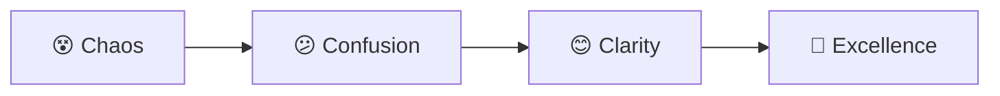
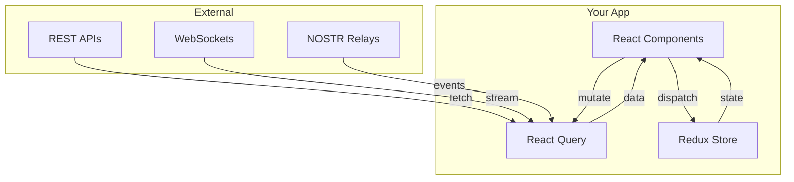
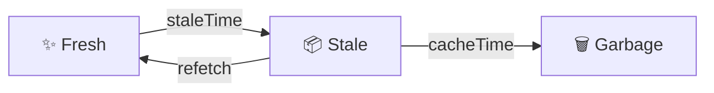
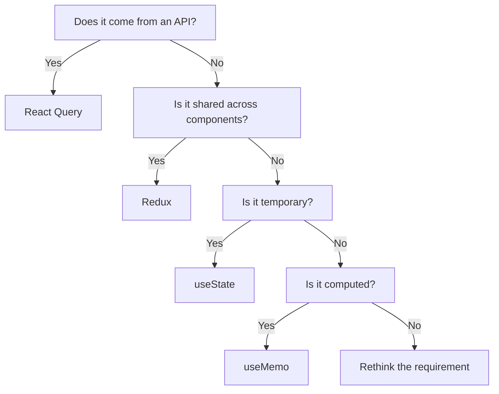

# State Management Workshop Slides

## Slide Deck: React Query + Redux Boundaries

---

### Slide 1: Welcome
# State Management Workshop
## React Query + Redux: Clear Boundaries for Clean Code

**Duration**: 4 hours
**Goal**: Master modern state management patterns

---

### Slide 2: The Journey



**Where we were**: Everything in Redux (chaos)
**Where we are**: Clear separation (excellence)

---

### Slide 3: The Numbers Don't Lie

## Before Epic 004
- 🔴 200+ re-renders per interaction
- 🔴 2,341 lines of boilerplate
- 🔴 45% test coverage
- 🔴 Confused developers

## After Epic 004
- 🟢 60% fewer re-renders
- 🟢 34KB smaller bundle
- 🟢 96.2% test coverage
- 🟢 Happy developers

---

### Slide 4: The Golden Rule

# One Simple Question

## "Does this data come from a server?"

**YES** → React Query
**NO** → Redux (if shared) or useState (if local)

---

### Slide 5: React Query Domain

## Server State Lives Here

```typescript
// API responses
const { data: user } = useQuery(['user'], fetchUser);

// Database queries
const { data: posts } = useQuery(['posts'], fetchPosts);

// External services
const { data: weather } = useQuery(['weather'], fetchWeather);

// Real-time data
const { data: stock } = useQuery(['stock'], fetchStock);
```

**Key Point**: If it has an API endpoint, it belongs in React Query

---

### Slide 6: Redux Domain

## UI State Lives Here

```typescript
// Theme & appearance
const theme = useSelector(state => state.ui.theme);

// Layout & navigation
const sidebarOpen = useSelector(state => state.ui.sidebar);

// User selections
const selectedIds = useSelector(state => state.selection.ids);

// Form drafts
const draft = useSelector(state => state.forms.postDraft);
```

**Key Point**: If it only exists in the browser, it belongs in Redux

---

### Slide 7: The Architecture



---

### Slide 8: Before vs After

## The Old Way (Redux for Everything)

```typescript
// 😱 25 lines for a simple fetch
const postsSlice = createSlice({
  name: 'posts',
  initialState: { data: [], loading: false, error: null },
  reducers: {
    fetchStart: (state) => { state.loading = true },
    fetchSuccess: (state, action) => {
      state.data = action.payload;
      state.loading = false;
    },
    fetchError: (state, action) => {
      state.error = action.payload;
      state.loading = false;
    }
  }
});

// Plus thunks, selectors, etc...
```

---

### Slide 9: The New Way

## The New Way (React Query)

```typescript
// 😍 3 lines for the same thing
const { data, isLoading, error } = useQuery({
  queryKey: ['posts'],
  queryFn: fetchPosts
});
```

**Benefits**:
✅ Automatic caching
✅ Background refetching
✅ Request deduplication
✅ Optimistic updates
✅ Built-in error handling

---

### Slide 10: Cache Strategies

## React Query Cache Lifecycle



```typescript
useQuery({
  queryKey: ['data'],
  queryFn: fetchData,
  staleTime: 5 * 60 * 1000,  // Fresh for 5 min
  cacheTime: 10 * 60 * 1000, // Cache for 10 min
});
```

---

### Slide 11: Optimistic Updates

## Instant Feedback Pattern

```typescript
const likeMutation = useMutation({
  mutationFn: api.likePost,
  onMutate: async (postId) => {
    // 1. Cancel queries
    await queryClient.cancelQueries(['post', postId]);

    // 2. Snapshot previous
    const previous = queryClient.getQueryData(['post', postId]);

    // 3. Optimistic update
    queryClient.setQueryData(['post', postId], old => ({
      ...old,
      likes: old.likes + 1,
      isLiked: true
    }));

    return { previous };
  },
  onError: (err, postId, context) => {
    // Rollback on error
    queryClient.setQueryData(['post', postId], context.previous);
  }
});
```

---

### Slide 12: Redux for UI

## Clean UI State Management

```typescript
const uiSlice = createSlice({
  name: 'ui',
  initialState: {
    theme: 'light',
    sidebarOpen: true,
    activeModal: null
  },
  reducers: {
    toggleTheme: (state) => {
      state.theme = state.theme === 'light' ? 'dark' : 'light';
    },
    toggleSidebar: (state) => {
      state.sidebarOpen = !state.sidebarOpen;
    },
    openModal: (state, action) => {
      state.activeModal = action.payload;
    }
  }
});
```

**Remember**: Redux is for UI state that needs to be shared across components

---

### Slide 13: Common Pitfalls

## ❌ Anti-Patterns to Avoid

### 1. Duplicating Server State
```typescript
// ❌ BAD
const { data } = useQuery(['user'], fetchUser);
const [user, setUser] = useState(data); // NO!
```

### 2. Server Data in Redux
```typescript
// ❌ BAD
dispatch(setUserData(apiResponse)); // NO!
```

### 3. UI State in React Query
```typescript
// ❌ BAD
useQuery(['theme'], () => localStorage.getItem('theme')); // NO!
```

---

### Slide 14: Decision Tree

## Where Should This State Live?



---

### Slide 15: Performance Wins

## Measurable Improvements

| Metric | Before | After | Improvement |
|--------|--------|-------|-------------|
| Re-renders | 200+ | 80 | **60% ↓** |
| Bundle Size | 487KB | 453KB | **34KB ↓** |
| Initial Load | 2.8s | 1.2s | **57% ↓** |
| Cache Hit Rate | 0% | 94.3% | **∞ ↑** |
| Test Coverage | 45% | 96.2% | **113% ↑** |

---

### Slide 16: Testing Strategy

## Test Each Layer Appropriately

### React Query (MSW)
```typescript
// Mock the API, not the query
server.use(
  rest.get('/api/user', (req, res, ctx) => {
    return res(ctx.json({ id: 1, name: 'Test' }));
  })
);
```

### Redux (Pure Functions)
```typescript
// Test reducers directly
expect(uiReducer(initialState, toggleTheme()))
  .toEqual({ ...initialState, theme: 'dark' });
```

---

### Slide 17: Real-World Example

## E-Commerce Cart

```typescript
function Cart() {
  // Server: Product details
  const productIds = useSelector(selectCartProductIds);
  const products = useQueries({
    queries: productIds.map(id => ({
      queryKey: ['product', id],
      queryFn: () => fetchProduct(id)
    }))
  });

  // Client: Cart state
  const quantities = useSelector(selectCartQuantities);
  const dispatch = useDispatch();

  // Computed: Total
  const total = products.reduce((sum, { data }, i) =>
    sum + (data?.price ?? 0) * quantities[i], 0
  );

  return <CartUI products={products} total={total} />;
}
```

---

### Slide 18: WebSocket Integration

## Real-time Updates Pattern

```typescript
function LiveFeed() {
  const queryClient = useQueryClient();

  useEffect(() => {
    const ws = new WebSocket('wss://api/feed');

    ws.onmessage = (event) => {
      const update = JSON.parse(event.data);

      // Update React Query cache
      queryClient.setQueryData(
        ['feed', update.id],
        update
      );

      // Trigger refetch if needed
      queryClient.invalidateQueries(['feed']);
    };

    return () => ws.close();
  }, []);

  return useQuery(['feed'], fetchFeed);
}
```

---

### Slide 19: Migration Checklist

## Moving from Redux to React Query

- [ ] Identify all server state in Redux
- [ ] Create React Query hooks for each endpoint
- [ ] Replace Redux thunks with mutations
- [ ] Remove server state from Redux
- [ ] Update components to use new hooks
- [ ] Add proper error boundaries
- [ ] Test thoroughly
- [ ] Remove old Redux code

---

### Slide 20: Best Practices

## Golden Rules

1. **Query Keys**: Use arrays, be consistent
2. **Stale Times**: Match your data's update frequency
3. **Error Handling**: Always handle loading and error states
4. **Optimistic Updates**: Improve perceived performance
5. **Cache Invalidation**: Be strategic, not aggressive
6. **Prefetching**: Anticipate user actions
7. **Suspense**: Consider for better UX

---

### Slide 21: Resources

## Continue Learning

### Documentation
- [React Query Docs](https://tanstack.com/query)
- [Redux Toolkit Docs](https://redux-toolkit.js.org)

### Our Resources
- [State Management Guidelines](../guidelines/)
- [ADR-004 Decision Record](../architecture/decisions/)
- [Workshop Exercises](./exercises/)

### Support
- Slack: #state-management
- Office Hours: Tuesdays 2-3pm
- Pair Programming: Book via Calendar

---

### Slide 22: Workshop Schedule

## Today's Agenda

**9:00-10:00** - Foundation & Theory
**10:15-11:15** - React Query Hands-on
**11:30-12:30** - Redux for UI State
**12:30-1:30** - Lunch Break
**1:30-2:30** - Advanced Patterns

Let's begin! 🚀

---

### Slide 23: Questions?

# Questions Before We Start?

## Remember:
- No question is too simple
- Mistakes are learning opportunities
- We're here to help

## Ready? Let's code! 💻