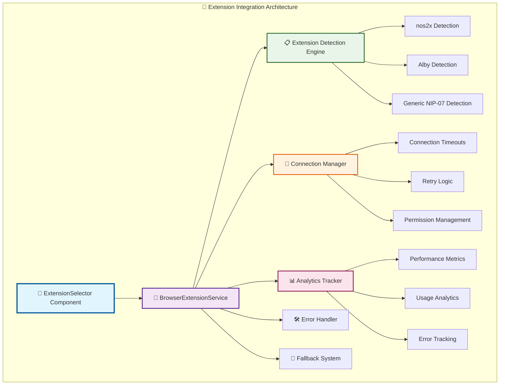

# 🛠 Extension Integration Developer Guide

**For Sovren Engineers**
**Version**: 1.0.0
**Last Updated**: January 20, 2025

## 🎯 **Overview**

This guide provides comprehensive technical documentation for integrating NOSTR browser extensions into Sovren applications. It covers the `BrowserExtensionService`, `ExtensionSelector` component, testing strategies, and best practices for extension development.

## 📚 **Table of Contents**

1. [Architecture Overview](#architecture-overview)
2. [API Reference](#api-reference)
3. [Implementation Patterns](#implementation-patterns)
4. [Testing Strategies](#testing-strategies)
5. [Error Handling](#error-handling)
6. [Performance Optimization](#performance-optimization)
7. [Security Considerations](#security-considerations)
8. [Best Practices](#best-practices)

---

## 🏗 **Architecture Overview**

### **System Components**



### **Core Principles**

1. **Graceful Degradation**: Always provide fallback options
2. **Performance First**: Minimize extension detection overhead
3. **Security by Design**: Validate all extension interactions
4. **Analytics Driven**: Comprehensive monitoring and metrics
5. **Developer Experience**: Clear APIs and comprehensive testing

---

## 📖 **API Reference**

### **BrowserExtensionService**

#### **Constructor**

```typescript
constructor(options?: BrowserExtensionOptions)

interface BrowserExtensionOptions {
  timeout?: number; // Default: 5000ms
  retryAttempts?: number; // Default: 3
  fallbackEnabled?: boolean; // Default: true
  analyticsEnabled?: boolean; // Default: true
}
```

#### **Core Methods**

##### **detectExtensions(): Promise<ExtensionInfo[]>**

Detects all available NOSTR browser extensions.

```typescript
interface ExtensionInfo {
  id: string;
  name: string;
  version?: string;
  capabilities: ExtensionCapability[];
  priority: number;
  isConnected: boolean;
  lastConnected?: Date;
  performance: {
    averageResponseTime: number;
    successRate: number;
    errorCount: number;
  };
}

enum ExtensionCapability {
  GET_PUBLIC_KEY = 'getPublicKey',
  SIGN_EVENT = 'signEvent',
  ENCRYPT = 'nip04.encrypt',
  DECRYPT = 'nip04.decrypt',
  LIGHTNING_PAYMENT = 'webln.sendPayment',
  LIGHTNING_INVOICE = 'webln.makeInvoice',
}
```

##### **connectToExtension(extensionId: string): Promise<ConnectedExtension>**

Establishes connection to a specific extension.

```typescript
interface ConnectedExtension {
  id: string;
  name: string;
  getPublicKey(): Promise<string>;
  signEvent(event: NostrEvent): Promise<NostrEvent>;
  encrypt?(pubkey: string, plaintext: string): Promise<string>;
  decrypt?(pubkey: string, ciphertext: string): Promise<string>;
  sendPayment?(invoice: string): Promise<PaymentResponse>;
  makeInvoice?(amount: number): Promise<string>;
}

interface NostrEvent {
  id?: string;
  pubkey?: string;
  created_at?: number;
  kind: number;
  tags: string[][];
  content: string;
  sig?: string;
}
```

##### **activateFallback(reason: string): void**

Activates fallback authentication mechanism.

```typescript
// Usage example
service.activateFallback('No extensions detected');
```

#### **Event Handling**

```typescript
// Subscribe to extension events
service.on('extensionDetected', (extension: ExtensionInfo) => {
  console.log('Extension detected:', extension);
});

service.on('extensionConnected', (extension: ConnectedExtension) => {
  console.log('Extension connected:', extension);
});

service.on('connectionFailed', (error: ExtensionError) => {
  console.error('Connection failed:', error);
});

service.on('fallbackActivated', (reason: string) => {
  console.log('Fallback activated:', reason);
});
```

#### **Analytics Methods**

```typescript
// Get performance metrics
const metrics = service.getAnalytics();

interface Analytics {
  detectionEvents: number;
  connectionAttempts: number;
  successfulConnections: number;
  failedConnections: number;
  averageDetectionTime: number;
  averageConnectionTime: number;
  extensionUsage: Record<string, number>;
  errorDistribution: Record<string, number>;
}
```

### **ExtensionSelector Component**

#### **Props Interface**

```typescript
interface ExtensionSelectorProps {
  onExtensionSelected: (extension: ConnectedExtension) => void;
  onFallbackActivated: (reason: string) => void;
  onError: (error: ExtensionError) => void;
  className?: string;
  autoConnect?: boolean; // Default: false
  showAnalytics?: boolean; // Default: false
  retryEnabled?: boolean; // Default: true
}
```

#### **Usage Examples**

```tsx
import { ExtensionSelector } from '@/components/auth/ExtensionSelector';

// Basic usage
<ExtensionSelector
  onExtensionSelected={(ext) => handleAuth(ext)}
  onFallbackActivated={(reason) => showManualAuth(reason)}
  onError={(error) => showError(error)}
/>

// Advanced usage with analytics
<ExtensionSelector
  onExtensionSelected={handleExtensionAuth}
  onFallbackActivated={handleFallback}
  onError={handleError}
  autoConnect={true}
  showAnalytics={true}
  retryEnabled={true}
  className="my-custom-extension-selector"
/>
```

---

## 🔧 **Implementation Patterns**

### **Extension Detection Pattern**

```typescript
class ExtensionDetector {
  private readonly DETECTION_TIMEOUT = 2000;
  private readonly MAX_RETRIES = 3;

  async detectAvailableExtensions(): Promise<ExtensionInfo[]> {
    const extensions: ExtensionInfo[] = [];

    // Detect nos2x
    if (await this.isNos2xAvailable()) {
      extensions.push(await this.createNos2xInfo());
    }

    // Detect Alby
    if (await this.isAlbyAvailable()) {
      extensions.push(await this.createAlbyInfo());
    }

    // Detect generic NIP-07 extensions
    const genericExtensions = await this.detectGenericExtensions();
    extensions.push(...genericExtensions);

    return this.prioritizeExtensions(extensions);
  }

  private async isNos2xAvailable(): Promise<boolean> {
    return new Promise((resolve) => {
      const timeout = setTimeout(() => resolve(false), this.DETECTION_TIMEOUT);

      if (window.nostr?.getPublicKey) {
        clearTimeout(timeout);
        resolve(true);
      } else {
        // Wait for extension to load
        const checkInterval = setInterval(() => {
          if (window.nostr?.getPublicKey) {
            clearTimeout(timeout);
            clearInterval(checkInterval);
            resolve(true);
          }
        }, 100);
      }
    });
  }
}
```

### **Connection Management Pattern**

```typescript
class ConnectionManager {
  private connections = new Map<string, ConnectedExtension>();
  private connectionAttempts = new Map<string, number>();

  async connectWithRetry(extensionId: string, maxRetries: number = 3): Promise<ConnectedExtension> {
    let lastError: Error;

    for (let attempt = 1; attempt <= maxRetries; attempt++) {
      try {
        const connection = await this.attemptConnection(extensionId);
        this.connections.set(extensionId, connection);
        this.trackConnectionSuccess(extensionId, attempt);
        return connection;
      } catch (error) {
        lastError = error;
        this.trackConnectionFailure(extensionId, attempt, error);

        if (attempt < maxRetries) {
          await this.delay(Math.pow(2, attempt) * 1000); // Exponential backoff
        }
      }
    }

    throw new ExtensionError(
      `Failed to connect after ${maxRetries} attempts: ${lastError.message}`,
      'CONNECTION_FAILED',
      { extensionId, attempts: maxRetries, lastError }
    );
  }

  private async attemptConnection(extensionId: string): Promise<ConnectedExtension> {
    switch (extensionId) {
      case 'nos2x':
        return this.connectToNos2x();
      case 'alby':
        return this.connectToAlby();
      default:
        return this.connectToGeneric(extensionId);
    }
  }
}
```

### **Error Handling Pattern**

```typescript
class ExtensionError extends Error {
  constructor(
    message: string,
    public code: ExtensionErrorCode,
    public details?: any
  ) {
    super(message);
    this.name = 'ExtensionError';
  }
}

enum ExtensionErrorCode {
  EXTENSION_NOT_FOUND = 'EXTENSION_NOT_FOUND',
  CONNECTION_TIMEOUT = 'CONNECTION_TIMEOUT',
  PERMISSION_DENIED = 'PERMISSION_DENIED',
  INVALID_RESPONSE = 'INVALID_RESPONSE',
  NETWORK_ERROR = 'NETWORK_ERROR',
  USER_REJECTED = 'USER_REJECTED',
}

// Usage in components
const handleExtensionError = (error: ExtensionError) => {
  switch (error.code) {
    case ExtensionErrorCode.EXTENSION_NOT_FOUND:
      showInstallationGuide();
      break;
    case ExtensionErrorCode.PERMISSION_DENIED:
      showPermissionInstructions();
      break;
    case ExtensionErrorCode.CONNECTION_TIMEOUT:
      offerRetryOption();
      break;
    default:
      showGenericErrorMessage(error.message);
  }
};
```

### **Performance Monitoring Pattern**

```typescript
class PerformanceMonitor {
  private metrics = new Map<string, PerformanceMetric[]>();

  measureOperation<T>(operation: string, fn: () => Promise<T>): Promise<T> {
    const startTime = performance.now();

    return fn()
      .then((result) => {
        const duration = performance.now() - startTime;
        this.recordSuccess(operation, duration);
        return result;
      })
      .catch((error) => {
        const duration = performance.now() - startTime;
        this.recordFailure(operation, duration, error);
        throw error;
      });
  }

  private recordSuccess(operation: string, duration: number): void {
    const metrics = this.getMetrics(operation);
    metrics.push({
      timestamp: Date.now(),
      duration,
      success: true,
    });
    this.pruneOldMetrics(operation);
  }
}
```

---

## 🧪 **Testing Strategies**

### **Unit Testing Extensions**

```typescript
import { BrowserExtensionService } from '@/services/browser-extension-service';

describe('BrowserExtensionService', () => {
  let service: BrowserExtensionService;
  let mockWindow: any;

  beforeEach(() => {
    // Mock window object
    mockWindow = {
      nostr: {
        getPublicKey: jest.fn(),
        signEvent: jest.fn(),
      },
      webln: {
        sendPayment: jest.fn(),
        makeInvoice: jest.fn(),
      },
    };
    global.window = mockWindow;

    service = new BrowserExtensionService();
  });

  describe('detectExtensions', () => {
    it('should detect nos2x extension', async () => {
      mockWindow.nostr.getPublicKey.mockResolvedValue('pubkey123');

      const extensions = await service.detectExtensions();

      expect(extensions).toHaveLength(1);
      expect(extensions[0].id).toBe('nos2x');
      expect(extensions[0].capabilities).toContain('getPublicKey');
    });

    it('should handle extension detection timeout', async () => {
      mockWindow.nostr.getPublicKey.mockImplementation(
        () => new Promise((resolve) => setTimeout(resolve, 10000))
      );

      const extensions = await service.detectExtensions();

      expect(extensions).toHaveLength(0);
    });
  });
});
```

### **Integration Testing**

```typescript
import { render, screen, fireEvent, waitFor } from '@testing-library/react';
import { ExtensionSelector } from '@/components/auth/ExtensionSelector';

describe('ExtensionSelector Integration', () => {
  it('should connect to extension and trigger callback', async () => {
    const onExtensionSelected = jest.fn();
    const onError = jest.fn();

    // Mock successful extension
    global.window.nostr = {
      getPublicKey: jest.fn().mockResolvedValue('pubkey123'),
      signEvent: jest.fn().mockResolvedValue({ sig: 'signature123' })
    };

    render(
      <ExtensionSelector
        onExtensionSelected={onExtensionSelected}
        onFallbackActivated={jest.fn()}
        onError={onError}
      />
    );

    // Wait for detection
    await waitFor(() => {
      expect(screen.getByText(/nos2x detected/i)).toBeInTheDocument();
    });

    // Click connect button
    fireEvent.click(screen.getByText(/connect to nos2x/i));

    // Verify connection callback
    await waitFor(() => {
      expect(onExtensionSelected).toHaveBeenCalledWith(
        expect.objectContaining({
          id: 'nos2x',
          getPublicKey: expect.any(Function)
        })
      );
    });
  });
});
```

### **E2E Testing**

```typescript
import { test, expect } from '@playwright/test';

test('Extension authentication flow', async ({ page }) => {
  // Install browser extension (requires extension testing setup)
  await page.goto('/auth');

  // Wait for extension detection
  await expect(page.locator('[data-testid="extension-detected"]')).toBeVisible();

  // Click connect button
  await page.click('[data-testid="connect-extension"]');

  // Handle extension popup (if any)
  const popup = await page.waitForEvent('popup');
  await popup.click('[data-testid="authorize"]');

  // Verify successful authentication
  await expect(page.locator('[data-testid="auth-success"]')).toBeVisible();
});
```

---

## 🛡 **Security Considerations**

### **Input Validation**

```typescript
class SecurityValidator {
  static validatePublicKey(pubkey: string): boolean {
    // NOSTR public keys are 64-character hex strings
    return /^[a-f0-9]{64}$/i.test(pubkey);
  }

  static validateSignature(signature: string): boolean {
    // NOSTR signatures are 128-character hex strings
    return /^[a-f0-9]{128}$/i.test(signature);
  }

  static sanitizeEventContent(content: string): string {
    // Remove potentially dangerous content
    return content
      .replace(/<script\b[^<]*(?:(?!<\/script>)<[^<]*)*<\/script>/gi, '')
      .replace(/javascript:/gi, '')
      .trim();
  }

  static validateEvent(event: NostrEvent): boolean {
    return (
      typeof event.kind === 'number' &&
      Array.isArray(event.tags) &&
      typeof event.content === 'string' &&
      (event.pubkey ? this.validatePublicKey(event.pubkey) : true)
    );
  }
}
```

### **Extension Trust Verification**

```typescript
class ExtensionTrustManager {
  private trustedExtensions = new Set(['nos2x', 'alby']);
  private extensionFingerprints = new Map([
    ['nos2x', 'expected-nos2x-fingerprint'],
    ['alby', 'expected-alby-fingerprint'],
  ]);

  verifyExtensionTrust(extensionId: string): boolean {
    if (!this.trustedExtensions.has(extensionId)) {
      console.warn(`Untrusted extension detected: ${extensionId}`);
      return false;
    }

    // Verify extension fingerprint if available
    const expectedFingerprint = this.extensionFingerprints.get(extensionId);
    if (expectedFingerprint) {
      const actualFingerprint = this.getExtensionFingerprint(extensionId);
      if (actualFingerprint !== expectedFingerprint) {
        console.error(`Extension fingerprint mismatch: ${extensionId}`);
        return false;
      }
    }

    return true;
  }
}
```

---

## ⚡ **Performance Optimization**

### **Lazy Loading Pattern**

```typescript
class LazyExtensionLoader {
  private extensionPromises = new Map<string, Promise<any>>();

  async loadExtension(extensionId: string): Promise<any> {
    if (!this.extensionPromises.has(extensionId)) {
      const promise = this.doLoadExtension(extensionId);
      this.extensionPromises.set(extensionId, promise);
    }

    return this.extensionPromises.get(extensionId);
  }

  private async doLoadExtension(extensionId: string): Promise<any> {
    switch (extensionId) {
      case 'nos2x':
        return import('./extensions/nos2x');
      case 'alby':
        return import('./extensions/alby');
      default:
        throw new Error(`Unknown extension: ${extensionId}`);
    }
  }
}
```

### **Caching Strategy**

```typescript
class ExtensionCache {
  private cache = new Map<string, CacheEntry>();
  private readonly TTL = 5 * 60 * 1000; // 5 minutes

  get<T>(key: string): T | null {
    const entry = this.cache.get(key);
    if (!entry || Date.now() > entry.expires) {
      this.cache.delete(key);
      return null;
    }
    return entry.value;
  }

  set<T>(key: string, value: T, ttl: number = this.TTL): void {
    this.cache.set(key, {
      value,
      expires: Date.now() + ttl,
    });
  }

  // Cache extension capabilities
  cacheExtensionInfo(extensionId: string, info: ExtensionInfo): void {
    this.set(`extension:${extensionId}`, info, 10 * 60 * 1000); // 10 minutes
  }
}
```

---

## 🚀 **Best Practices**

### **Development Guidelines**

1. **Always provide fallbacks**: Never assume extensions are available
2. **Implement timeout handling**: Extensions can be slow or unresponsive
3. **Use progressive enhancement**: Start with basic functionality, add features incrementally
4. **Monitor performance**: Track detection times, connection success rates
5. **Handle errors gracefully**: Provide clear error messages and recovery options

### **Code Quality Standards**

```typescript
// ✅ Good: Clear interface with proper typing
interface ExtensionConnection {
  readonly id: string;
  readonly name: string;
  getPublicKey(): Promise<string>;
  signEvent(event: NostrEvent): Promise<NostrEvent>;
}

// ❌ Bad: Unclear interface with any types
interface ExtensionConnection {
  id: any;
  methods: any;
}

// ✅ Good: Proper error handling with specific error types
try {
  const extension = await service.connectToExtension('nos2x');
  return extension;
} catch (error) {
  if (error instanceof ExtensionError) {
    switch (error.code) {
      case ExtensionErrorCode.PERMISSION_DENIED:
        showPermissionHelp();
        break;
      default:
        showGenericError(error.message);
    }
  }
  throw error;
}

// ❌ Bad: Generic error handling
try {
  const extension = await service.connectToExtension('nos2x');
  return extension;
} catch (error) {
  console.error(error);
}
```

### **Testing Requirements**

1. **Unit tests**: Test all service methods and component behavior
2. **Integration tests**: Test extension detection and connection flows
3. **Error scenario tests**: Test timeout, permission denied, invalid responses
4. **Performance tests**: Measure detection and connection times
5. **Security tests**: Validate input sanitization and trust verification

### **Documentation Standards**

1. **API documentation**: Document all public methods with examples
2. **Error catalog**: Document all possible errors and recovery steps
3. **Performance benchmarks**: Include expected performance metrics
4. **Security guidelines**: Document security considerations and best practices
5. **Migration guides**: Document changes between versions

---

## 📋 **Deployment Checklist**

### **Pre-deployment Validation**

- [ ] All unit tests passing (minimum 95% coverage)
- [ ] Integration tests passing
- [ ] Performance benchmarks met
- [ ] Security scan clean
- [ ] Error handling tested
- [ ] Fallback mechanisms working
- [ ] Documentation updated
- [ ] Analytics tracking verified

### **Post-deployment Monitoring**

- [ ] Extension detection rates
- [ ] Connection success rates
- [ ] Error frequency and types
- [ ] Performance metrics
- [ ] User feedback
- [ ] Browser compatibility
- [ ] Extension version compatibility

---

## 🔗 **Related Documentation**

- [Browser Extension Setup Guide](browser-extension-setup-guide.md)
- [Troubleshooting Guide](troubleshooting-guide.md)
- [Browser Extension Integration](../features/browser-extension-integration.md)
- [NOSTR Authentication Flow](../architecture/us-213-nostr-authentication-flow-architecture.md)

---

## 🆘 **Support**

**For Development Issues**:

- Internal Slack: #sovren-dev
- Email: dev-support@sovren.app

**For Architecture Questions**:

- Architecture Review Board
- Email: architecture@sovren.app

**For Security Concerns**:

- Security Team: security@sovren.app
- Emergency: security-emergency@sovren.app

---

**Version**: 1.0.0
**Last Updated**: January 20, 2025
**Next Review**: February 20, 2025
