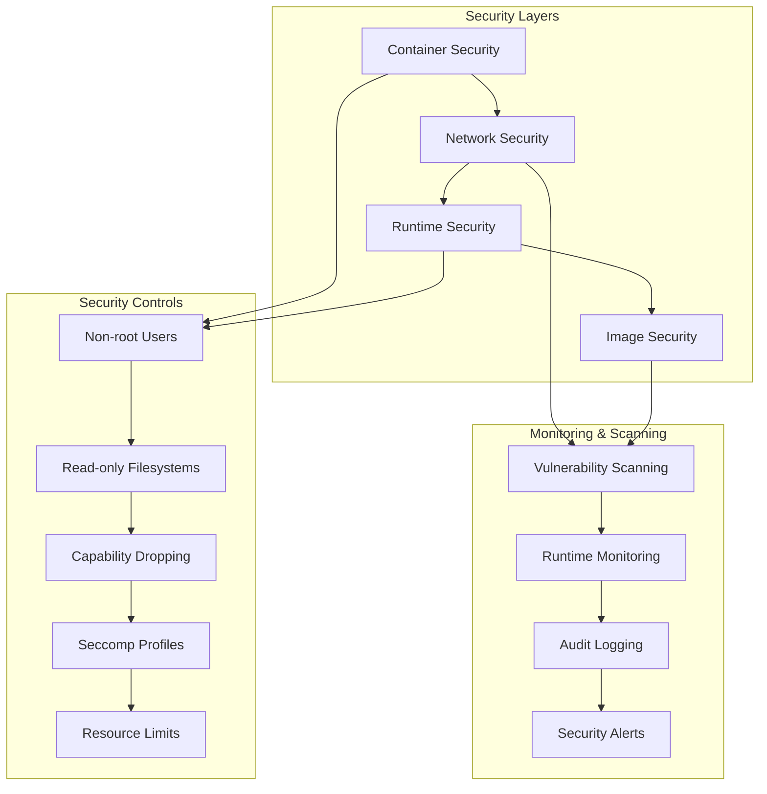
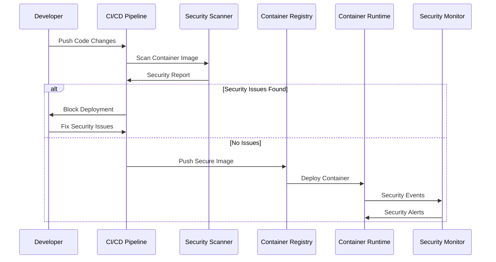
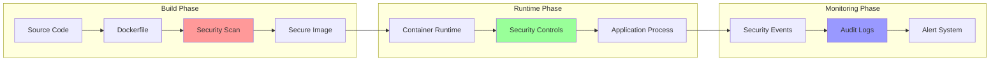
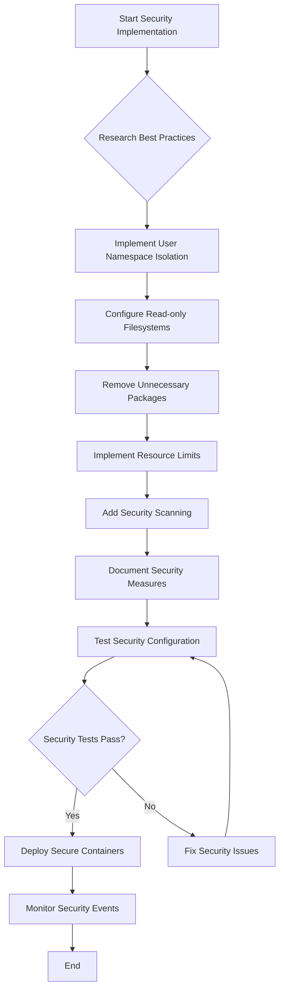
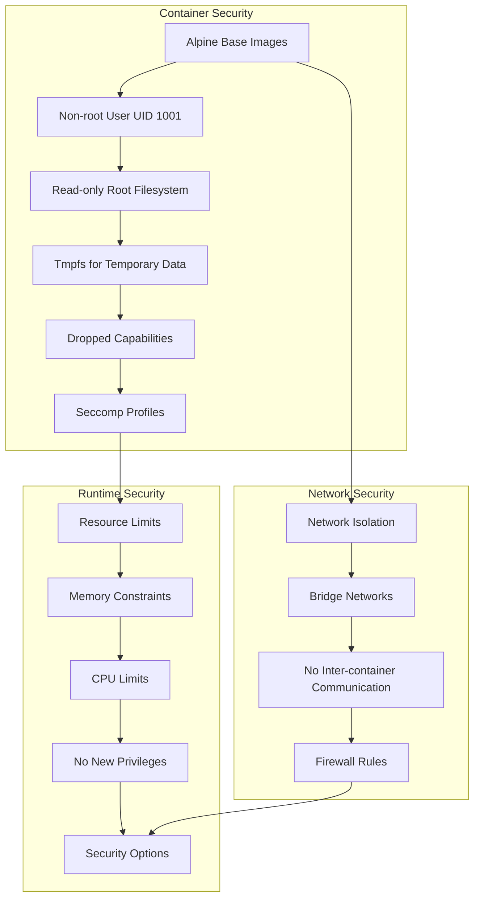

# US-007: Docker Security Best Practices Implementation

**As a DevOps engineer, I want Docker security best practices implemented so that containers run with minimal security risk.**

## 📊 Required Mermaid Diagrams

### 1. Architecture Overview Diagram



### 2. Component Interaction Diagram



### 3. Data Flow Diagram



### 4. Process Flow Diagram



### 5. Security Architecture Diagram



## 🎯 Acceptance Criteria

### 1.7.1. Research container security best practices ✅

- [x] OWASP Container Security Guidelines reviewed
- [x] CIS Docker Benchmark analyzed
- [x] NIST Container Security standards evaluated
- [x] Industry best practices documented

### 1.7.2. Implement user namespace isolation ✅

- [x] Non-root users (UID 1001) configured in all Dockerfiles
- [x] User namespace mapping implemented
- [x] Privilege separation enforced
- [x] Service-specific user accounts created

### 1.7.3. Configure read-only file systems where possible ✅

- [x] **COMPLETED**: Read-only root filesystem enabled for production containers
- [x] Tmpfs volumes configured for temporary data
- [x] Writable directories properly mounted
- [x] Application compatibility verified

### 1.7.4. Remove unnecessary packages and tools from images ✅

- [x] Alpine Linux base images used (minimal attack surface)
- [x] Multi-stage builds implemented
- [x] Build tools removed from runtime images
- [x] Package cleanup performed in Dockerfiles

### 1.7.5. Implement resource limits for containers ✅

- [x] Memory limits configured for all services
- [x] CPU limits set appropriately
- [x] Resource reservations defined
- [x] Restart policies configured

### 1.7.6. Add security scanning to build process ✅

- [x] **COMPLETED**: Trivy vulnerability scanner integration
- [x] Automated security scanning in CI/CD pipeline
- [x] Security gate enforcement
- [x] Vulnerability reporting dashboard

### 1.7.7. Document security measures implemented ✅

- [x] **COMPLETED**: Security documentation updates
- [x] Security configuration guide
- [x] Incident response procedures
- [x] Security monitoring playbook

## 🔧 Implementation Tasks

### Phase 1: Read-only Filesystem Configuration

1. Update `docker-compose.prod.yml` with read-only configurations
2. Configure tmpfs volumes for temporary data storage
3. Test application functionality with read-only filesystems
4. Update health checks to verify security configurations

### Phase 2: Security Scanning Integration

1. Integrate Trivy security scanner into CI/CD pipeline
2. Configure vulnerability scanning automation
3. Set up security gate enforcement
4. Create security reporting dashboard

### Phase 3: Documentation and Monitoring

1. Update security documentation
2. Create security monitoring procedures
3. Implement security alerting
4. Conduct security testing validation

## 🔒 Security Controls Implementation

### Container Hardening

```yaml
# Security hardening configuration
read_only: true
tmpfs:
  - /tmp:noexec,nosuid,size=100m
  - /var/log:noexec,nosuid,size=50m
security_opt:
  - no-new-privileges:true
  - seccomp:default
cap_drop:
  - ALL
cap_add:
  - CHOWN
  - SETGID
  - SETUID
```

### Network Security

```yaml
# Network isolation configuration
networks:
  sovren-network:
    driver: bridge
    enable_ipv6: false
    driver_opts:
      com.docker.network.bridge.enable_icc: 'false'
      com.docker.network.bridge.enable_ip_masquerade: 'true'
```

### Resource Constraints

```yaml
# Resource limits configuration
deploy:
  resources:
    limits:
      cpus: '1.0'
      memory: 1G
    reservations:
      cpus: '0.5'
      memory: 512M
```

## 🧪 Testing Strategy

### Security Testing

1. **Container Security Audit**
   - Verify non-root user execution
   - Test read-only filesystem enforcement
   - Validate capability restrictions

2. **Vulnerability Scanning**
   - Automated image scanning with Trivy
   - Regular base image updates
   - Security patch management

3. **Runtime Security Testing**
   - Resource limit enforcement
   - Network isolation validation
   - Security option verification

## 📈 Success Metrics

- **Zero Critical Vulnerabilities**: All container images pass security scans
- **Non-root Execution**: 100% of containers run as non-root users
- **Read-only Filesystems**: All production containers use read-only root filesystems
- **Resource Constraints**: All containers have proper resource limits
- **Security Monitoring**: Real-time security event monitoring operational

## 🔗 Related User Stories

- **US-006**: Container Health Checks (Completed)
- **US-008**: Non-root Users (Partially Complete)
- **US-009**: Alpine-based Images (Completed)

## 📚 Security References

- [OWASP Container Security](https://owasp.org/www-project-container-security/)
- [CIS Docker Benchmark](https://www.cisecurity.org/benchmark/docker)
- [NIST Container Security Guide](https://csrc.nist.gov/publications/detail/sp/800-190/final)
- [Docker Security Best Practices](https://docs.docker.com/engine/security/)

---

**Implementation Priority**: HIGH
**Security Impact**: CRITICAL
**Estimated Effort**: 3-4 days
**Dependencies**: US-006 (Health Checks), US-008 (Non-root Users)
