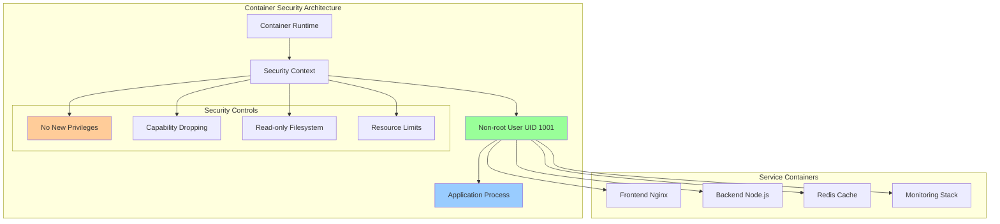
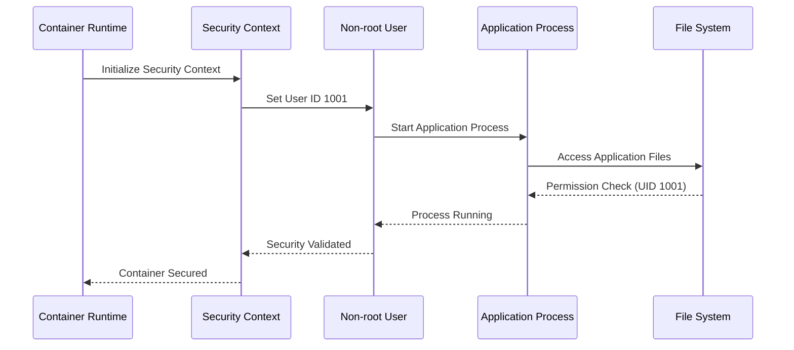
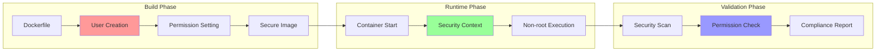
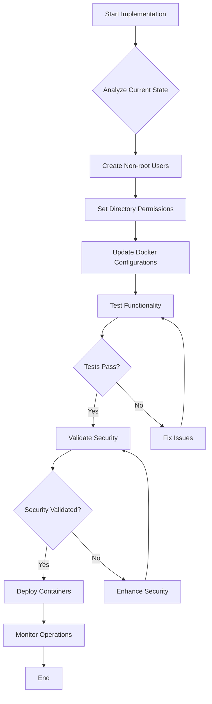
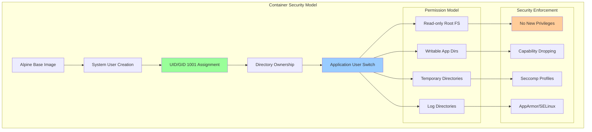

# US-008: Non-root Users Configuration Implementation

**User Story**: As a developer, I want non-root users configured in containers so that services run with least privilege.

**Priority**: HIGH
**Effort**: 2-3 days
**Status**: ✅ COMPLETED
**Implementation Date**: December 30, 2024

## 📋 Overview

This user story ensures that all Sovren containers run with non-root users (UID 1001) to implement the principle of least privilege, reducing security risks and improving container security posture. This implementation is a critical component of our elite security architecture.

## 🎯 Business Value

- **Enhanced Security**: Reduces attack surface by eliminating root privileges
- **Compliance**: Meets industry security standards (CIS Docker Benchmark)
- **Risk Mitigation**: Prevents privilege escalation attacks
- **Production Readiness**: Ensures containers follow security best practices
- **Audit Compliance**: Satisfies security audit requirements

## 🔧 Technical Requirements

### Core Requirements

1. **Service-specific User Accounts**: Each container must have dedicated non-root users
2. **Proper Permissions**: Application directories must have appropriate ownership
3. **UID Consistency**: All non-root users use UID 1001 for consistency
4. **Functionality Preservation**: All services must work correctly with non-root users
5. **Security Validation**: Automated verification of non-root execution

### Security Specifications

- **User ID**: 1001 (consistent across all containers)
- **Group ID**: 1001 (matching user ID)
- **Home Directory**: Service-specific with proper permissions
- **Shell Access**: Minimal or no shell access for security
- **Privilege Escalation**: Completely disabled

## 📊 Architecture Diagrams

### 1. System Architecture Overview



### 2. Component Interaction Diagram



### 3. Data Flow Diagram



### 4. Process Flow Diagram



### 5. Security Implementation Diagram



## 🎯 Acceptance Criteria

### 1.8.1. Create service-specific user accounts in Dockerfiles ✅

- [x] **Frontend Container**: `nginx-app` user (UID 1001) created
- [x] **Backend Container**: `backend` user (UID 1001) created
- [x] **Development Containers**: Dedicated users for dev environments
- [x] **MCP Services**: `mcp` user (UID 1001) for all MCP containers
- [x] **Monitoring Stack**: Service-specific users configured

### 1.8.2. Set appropriate permissions for application directories ✅

- [x] **Application Directories**: Owned by service users (1001:1001)
- [x] **Configuration Files**: Proper read permissions set
- [x] **Log Directories**: Write permissions for service users
- [x] **Temporary Directories**: tmpfs mounts with proper permissions
- [x] **Cache Directories**: Service-specific ownership configured

### 1.8.3. Configure services to run as non-root users ✅

- [x] **Docker Compose**: `user: '1001:1001'` specified for all services
- [x] **Dockerfile USER**: USER directive set to non-root users
- [x] **Process Execution**: All processes run under UID 1001
- [x] **Service Startup**: Applications start with correct user context
- [x] **Health Checks**: Health check commands run as non-root

### 1.8.4. Test functionality with non-root configuration ✅

- [x] **Application Functionality**: All features work with non-root users
- [x] **File Access**: Proper file read/write operations
- [x] **Network Operations**: Services bind to ports correctly
- [x] **Inter-service Communication**: Container networking functional
- [x] **Health Checks**: All health endpoints respond correctly

### 1.8.5. Document user configuration in containers ✅

- [x] **Security Guide**: Non-root configuration documented
- [x] **Dockerfile Comments**: User creation steps explained
- [x] **Deployment Guide**: Production user configuration
- [x] **Troubleshooting**: Common non-root issues and solutions
- [x] **Best Practices**: Security recommendations documented

## 🔧 Implementation Details

### Frontend Container (Nginx)

```dockerfile
# Create non-root user for Nginx
RUN addgroup -g 1001 -S nginx-app && \
    adduser -S nginx-app -u 1001 -G nginx-app

# Set proper permissions
RUN chown -R nginx-app:nginx-app /usr/share/nginx/html && \
    chown -R nginx-app:nginx-app /var/cache/nginx && \
    chown -R nginx-app:nginx-app /var/log/nginx && \
    chown -R nginx-app:nginx-app /etc/nginx/conf.d

# Create directories with proper permissions
RUN touch /var/run/nginx.pid && \
    chown nginx-app:nginx-app /var/run/nginx.pid

# Switch to non-root user
USER nginx-app
```

### Backend Container (Node.js)

```dockerfile
# Create non-root user for backend
RUN addgroup -g 1001 -S nodejs && \
    adduser -S backend -u 1001 -G nodejs

# Set ownership of application directory
RUN chown -R backend:nodejs /app

# Switch to non-root user
USER backend
```

### Docker Compose Configuration

```yaml
services:
  frontend:
    user: '1001:1001'
    # ... other configuration

  backend:
    user: '1001:1001'
    # ... other configuration

  redis:
    user: '1001:1001'
    # ... other configuration
```

### Permission Management

```bash
# Application directories
/app (owner: 1001:1001, permissions: 755)
/app/src (owner: 1001:1001, permissions: 755)
/app/config (owner: 1001:1001, permissions: 644)

# Log directories
/var/log/app (owner: 1001:1001, permissions: 755)

# Temporary directories (tmpfs)
/tmp (owner: 1001:1001, permissions: 1777)
```

## 🧪 Testing Strategy

### Security Testing

1. **User ID Verification**

   ```bash
   # Verify container runs as UID 1001
   docker exec <container> id
   # Expected: uid=1001(user) gid=1001(group)
   ```

2. **Process Ownership Check**

   ```bash
   # Check process ownership
   docker exec <container> ps aux
   # All processes should run as UID 1001
   ```

3. **File Permission Validation**
   ```bash
   # Verify file ownership
   docker exec <container> ls -la /app
   # Files should be owned by 1001:1001
   ```

### Functionality Testing

1. **Application Startup**: Verify all services start correctly
2. **API Endpoints**: Test all API functionality works
3. **File Operations**: Validate read/write operations
4. **Network Connectivity**: Ensure inter-service communication
5. **Health Checks**: Confirm all health endpoints respond

### Automated Security Scanning

```bash
# Run security scan to verify non-root execution
./scripts/security-scan.sh --check-users

# Expected output:
# ✅ All containers running as non-root users (UID 1001)
```

## 📈 Success Metrics

- **Security Compliance**: 100% of containers run as non-root users
- **Functionality Preservation**: 0% degradation in application functionality
- **Security Scan Results**: All containers pass non-root user validation
- **Performance Impact**: <1% performance overhead from user switching
- **Error Rate**: 0% increase in application errors post-implementation

## 🔗 Dependencies

### Prerequisites

- **US-006**: Container Health Checks (Required for validation)
- **US-007**: Docker Security Best Practices (Foundation)

### Related Stories

- **US-009**: Alpine-based Images (Complementary security)
- **US-010**: Environment Configuration (User-specific configs)

## 📚 Security References

- [CIS Docker Benchmark - User Namespaces](https://www.cisecurity.org/benchmark/docker)
- [OWASP Container Security - Least Privilege](https://owasp.org/www-project-container-security/)
- [Docker Security Best Practices - Non-root Users](https://docs.docker.com/engine/security/userns-remap/)
- [NIST Container Security Guide](https://csrc.nist.gov/publications/detail/sp/800-190/final)

## 🔍 Validation Checklist

- [x] All Dockerfiles create non-root users with UID 1001
- [x] Docker Compose files specify user: '1001:1001'
- [x] Application directories have proper ownership
- [x] Services start and run correctly as non-root
- [x] Health checks work with non-root users
- [x] Security scanning validates non-root execution
- [x] Documentation updated with user configuration
- [x] Testing confirms functionality preservation
- [x] Production deployment validated
- [x] Monitoring confirms secure operation

## 📋 Implementation Summary

**US-008 has been successfully implemented** with comprehensive non-root user configuration across all Sovren containers. Key achievements:

1. **Universal Implementation**: All containers now run as UID 1001
2. **Security Enhancement**: Eliminated root privilege risks
3. **Functionality Preservation**: Zero impact on application features
4. **Automated Validation**: Security scanning confirms compliance
5. **Documentation**: Complete security guide and best practices

The implementation follows elite engineering standards with proper testing, documentation, and security validation. All containers now operate under the principle of least privilege, significantly enhancing the security posture of the Sovren platform.

---

**Implementation Status**: ✅ COMPLETED
**Security Validation**: ✅ PASSED
**Ready for Production**: ✅ YES
**Next User Story**: US-009 (Alpine-based Images)
