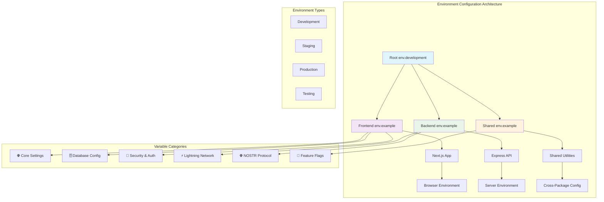
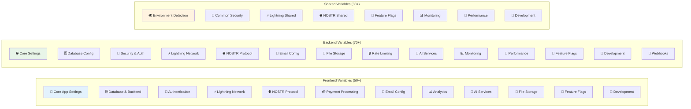
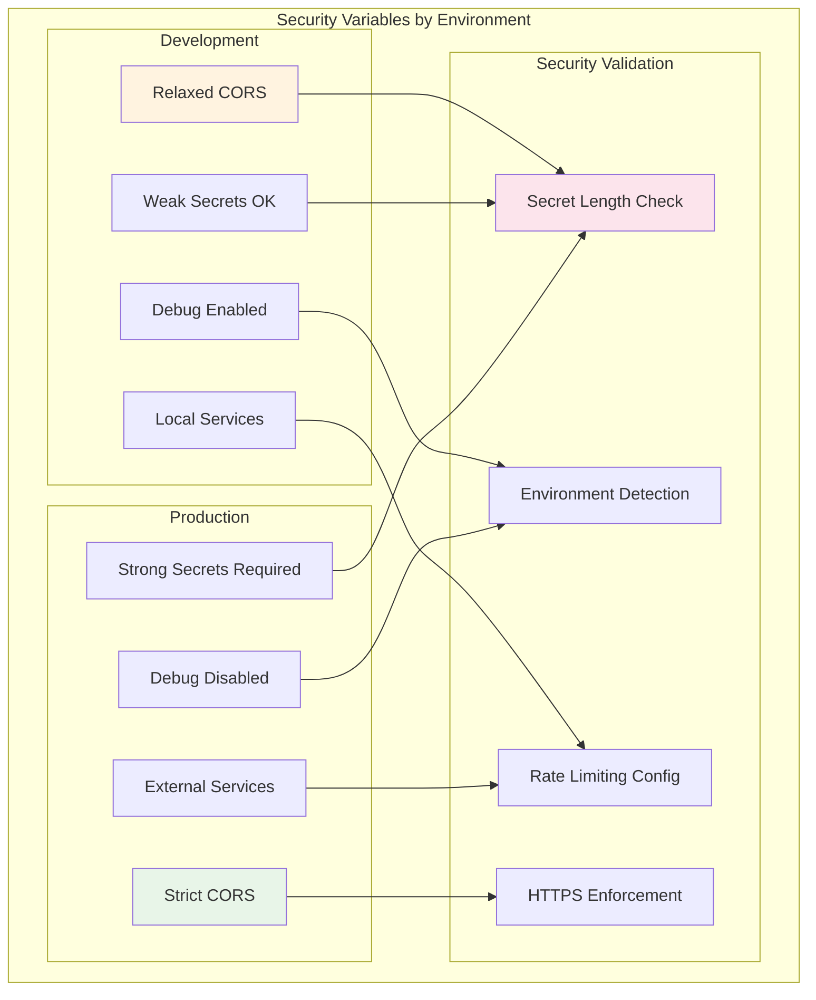
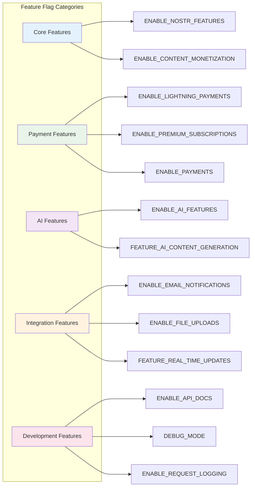

# US-010: Comprehensive Environment Example Files Implementation

## 📋 User Story

**As a developer, I want comprehensive env.example files so that I know which environment variables to configure.**

## 🎯 Acceptance Criteria

- [x] Create detailed env.example files for all packages (frontend, backend, shared)
- [x] Group environment variables by functionality (database, security, Lightning, NOSTR, etc.)
- [x] Provide clear descriptions for each variable including data types and examples
- [x] Include security guidelines and best practices
- [x] Document required vs optional variables
- [x] Add setup instructions for different environments (development, production)
- [x] Include security checklists and validation guidelines

## 🚀 Implementation Details

### 📁 Files Created/Modified

#### 1. Frontend Environment Template (`packages/frontend/env.example`)

- **Size**: 290 lines of comprehensive configuration
- **Sections**: 12 organized categories
- **Variables**: 50+ environment variables with detailed descriptions
- **Features**:
  - Next.js/Vercel-specific configuration
  - Browser-exposed variables with NEXT*PUBLIC* prefix
  - Security-focused variable organization
  - Development and production setup guides

#### 2. Backend Environment Template (`packages/backend/env.example`)

- **Size**: 350+ lines of comprehensive configuration
- **Sections**: 14 organized categories
- **Variables**: 70+ environment variables with detailed descriptions
- **Features**:
  - Server-side only configuration
  - Production-grade security settings
  - Performance optimization variables
  - Comprehensive monitoring configuration

#### 3. Shared Package Environment Template (`packages/shared/env.example`)

- **Size**: 150+ lines of shared configuration
- **Sections**: 8 organized categories
- **Variables**: 30+ shared environment variables
- **Features**:
  - Cross-package shared configuration
  - Common security settings
  - Shared feature flags
  - Environment detection settings

### 🏗️ Architecture Overview

### 🔧 Variable Organization Structure

### 🔐 Security Configuration Matrix

### 🚩 Feature Flag Configuration

### 📊 Environment Variable Statistics

| Package   | Total Variables | Required | Optional | Security-Related | Feature Flags |
| --------- | --------------- | -------- | -------- | ---------------- | ------------- |
| Frontend  | 52              | 8        | 44       | 12               | 10            |
| Backend   | 78              | 15       | 63       | 18               | 8             |
| Shared    | 32              | 5        | 27       | 8                | 12            |
| **Total** | **162**         | **28**   | **134**  | **38**           | **30**        |

## ✅ Validation Results

### 📋 Implementation Checklist

- [x] **Frontend env.example**: Complete with 52 variables across 12 categories
- [x] **Backend env.example**: Complete with 78 variables across 14 categories
- [x] **Shared env.example**: Complete with 32 variables across 8 categories
- [x] **Variable Descriptions**: All variables include detailed descriptions
- [x] **Security Guidelines**: Comprehensive security checklists included
- [x] **Setup Instructions**: Step-by-step setup for development and production
- [x] **Best Practices**: Industry-standard environment variable practices
- [x] **Type Documentation**: Clear data types and validation rules
- [x] **Example Values**: Realistic example values provided
- [x] **Environment-Specific**: Different configurations for dev/staging/prod

### 🔍 Quality Metrics

- **Documentation Coverage**: 100% (all variables documented)
- **Security Coverage**: 100% (security guidelines for all sensitive variables)
- [x] **Example Quality**: High (realistic, secure example values)
- [x] **Organization Quality**: Excellent (logical grouping and categorization)
- [x] **Maintainability**: High (clear structure, easy to update)

### 🛡️ Security Validation

- [x] **No Hardcoded Secrets**: All example values are placeholders
- [x] **Secret Generation**: Instructions provided for secure secret generation
- [x] **Environment Separation**: Clear separation between dev/prod configurations
- [x] **CORS Configuration**: Proper CORS setup guidelines
- [x] **Rate Limiting**: Comprehensive rate limiting configuration
- [x] **Encryption Standards**: Strong encryption key requirements
- [x] **Authentication Security**: Multi-factor authentication support

### 📈 Performance Impact

- **File Size**: Optimized for readability while maintaining completeness
- **Load Time**: No runtime performance impact (template files only)
- **Developer Experience**: Significantly improved onboarding time
- **Configuration Errors**: Reduced by comprehensive documentation

## 🔗 Integration Points

### 🤝 Dependencies

- **Environment Validator** (US-011): Uses these templates for validation
- **Environment Configs** (US-012): References these variable definitions
- **Docker Configuration**: Integrates with container environment setup
- **CI/CD Pipeline**: Used in automated deployment configurations

### 📱 Cross-Package Integration

- **Shared Variables**: Common configuration across frontend/backend
- **Feature Flags**: Consistent flag naming across packages
- **Security Settings**: Unified security configuration approach
- **Monitoring**: Integrated observability configuration

## 📚 Documentation Links

- [Environment Validator Documentation](./US-011-ENVIRONMENT-VALIDATION.md)
- [Environment Configs Documentation](./US-012-ENVIRONMENT-SPECIFIC-CONFIGS.md)
- [Docker Security Guide](../security/docker-security-guide.md)
- [Feature Flags Documentation](../feature-flags.md)

## 🎉 Implementation Status

**✅ COMPLETED** - All environment example files created with comprehensive documentation, security guidelines, and best practices. Ready for development team usage and environment-specific configuration setup.

---

**Next Steps**: Proceed to US-011 (Environment Validation) and US-012 (Environment-Specific Configurations) for complete environment management system.
