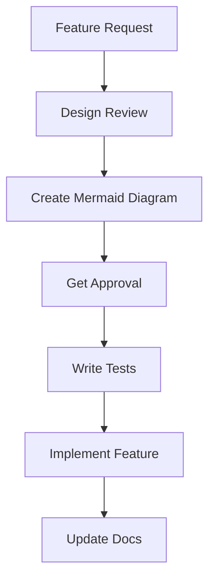

# 🚀 Sovren Agent Orchestration Dashboard

Real-time monitoring dashboard for autonomous agent development with beautiful dark theme UI and live task tracking.

[](https://nodejs.org/)
[](LICENSE)
[](http://localhost:3000)


> **Note**: Add screenshot to `docs/screenshot-placeholder.png` showing the dashboard in action

---

## 📋 Table of Contents

- [Features](#-features)
- [Tech Stack](#-tech-stack)
- [Quick Start](#-quick-start)
- [Installation](#-installation)
- [Usage](#-usage)
- [Project Structure](#-project-structure)
- [Data Formats](#-data-formats)
- [Configuration](#-configuration)
- [API Reference](#-api-reference)
- [Socket.IO Events](#-socketio-events)
- [Development](#-development)
- [Testing](#-testing)
- [Troubleshooting](#-troubleshooting)
- [Production Deployment](#-production-deployment)
- [Contributing](#-contributing)
- [License](#-license)

---

## ✨ Features

### Real-Time Monitoring
- **Live Task Updates**: WebSocket-powered instant updates via Socket.IO
- **File Watching**: Automatic detection of changes to tasks, logs, and metrics
- **Zero Refresh**: All updates happen in real-time without page reload
- **Connection Status**: Visual indicator showing server connection health

### Beautiful UI/UX
- **Dark Theme**: VS Code-inspired professional dark interface
- **Responsive Design**: Seamless experience from mobile to desktop (320px to 4K)
- **Smooth Animations**: CSS transitions for all state changes
- **Auto-Scroll Logs**: Automatically scroll to latest log entries
- **Progress Animations**: Gradient animated progress bars

### Task Management Visualization
- **Multiple Task States**: Active, Blocked, Completed, Queued
- **Visual Task Cards**: Color-coded cards with agent assignment
- **Progress Tracking**: Real-time percentage and visual indicators
- **Priority Badges**: High, Medium, Low priority indicators
- **Empty States**: Helpful messages when no tasks exist

### Activity Logging
- **Syntax Highlighting**: Color-coded log levels (INFO, SUCCESS, WARNING, ERROR, DEBUG)
- **Timestamp Tracking**: ISO 8601 formatted timestamps for all events
- **Agent Attribution**: Clear agent identification in logs
- **Log Controls**: Auto-scroll toggle and clear logs button
- **Smart Truncation**: Displays last 100 log lines for performance

### Performance Metrics
- **Live Statistics**: Completed, Active, Blocked, and Total task counts
- **Progress Percentage**: Overall completion tracking
- **Uptime Monitoring**: System uptime display in HH:MM:SS format
- **Phase Tracking**: Current project phase indicator
- **Project Info**: Project ID and metadata display

---

## 🛠 Tech Stack

### Backend
- **Node.js** (18+) - JavaScript runtime
- **Express** (4.18.2) - Fast, minimalist web framework
- **Socket.IO** (4.6.1) - Real-time bidirectional event-based communication
- **Chokidar** (3.5.3) - Efficient file watching with debouncing

### Frontend
- **HTML5** - Semantic markup with ARIA accessibility
- **CSS3** - Modern CSS with custom properties (CSS variables)
- **Vanilla JavaScript (ES6+)** - No frameworks, pure performance
- **Socket.IO Client** - WebSocket client library

### Real-Time Communication
- **WebSocket Protocol** - Low-latency bidirectional communication via Socket.IO
- **Event-Driven Architecture** - Pub/sub pattern for data updates

---

## 🚀 Quick Start

Get the dashboard running in under 60 seconds:

```bash
# Navigate to dashboard directory
cd /Users/fp/Desktop/Sovren/monitoring/dashboard

# Install dependencies (one-time setup)
npm install

# Start the server
npm start

# Open your browser to http://localhost:3000
```

**That's it!** The dashboard is now running and watching for data changes.

---

## 📦 Installation

### Prerequisites

Before starting, ensure you have:

- **Node.js 18.0.0 or higher** ([Download](https://nodejs.org/))
- **npm** (comes with Node.js)
- **Modern web browser** (Chrome, Firefox, Safari, Edge)

### Verify Node Version

```bash
node --version  # Should be v18.0.0 or higher
npm --version   # Should be 8.0.0 or higher
```

### Install Dependencies

```bash
# Clone the repository (if not already cloned)
cd /Users/fp/Desktop/Sovren

# Navigate to dashboard
cd monitoring/dashboard

# Install production dependencies
npm install

# Verify installation
npm ls
```

**Dependencies installed:**
- `express@^4.18.2` - Web server framework
- `socket.io@^4.6.1` - Real-time communication
- `chokidar@^3.5.3` - File system watcher

---

## 📖 Usage

### Starting the Dashboard

#### 1. Production Mode

```bash
npm start
```

The server will:
- Create the `data/` directory if it doesn't exist
- Initialize default data files (tasks.json, orchestration.log, metrics.json)
- Start watching files for changes
- Launch HTTP server on port 3000
- Open WebSocket connections for real-time updates

**Console output:**
```
🚀 Sovren Monitoring Dashboard Server
=====================================

✓ Data directory: /path/to/monitoring/dashboard/data
✓ tasks.json exists
✓ orchestration.log exists
✓ metrics.json exists
✓ Initial data loaded into cache

📡 Initializing file watchers...
✓ Watching: tasks.json
✓ Watching: orchestration.log
✓ Watching: metrics.json

✅ Server started successfully!
📍 HTTP Server: http://localhost:3000
📍 API Status: http://localhost:3000/api/status
📍 Socket.IO: Ready for connections

👀 Monitoring files for changes...
Press Ctrl+C to stop
```

#### 2. Development Mode

```bash
npm run dev
```

Same as production mode (uses same command). For development with auto-restart, use `nodemon`:

```bash
# Install nodemon globally (one-time)
npm install -g nodemon

# Run with auto-restart
nodemon server.js
```

### Running Test Data Generator

The test data generator simulates realistic agent activity:

```bash
npm run test
```

**What it does:**
- Creates 6 sample tasks with different states
- Generates continuous log entries (1-3 per 2-3 seconds)
- Updates task progress randomly
- Simulates task completion, blocking, and unblocking
- Updates metrics every iteration

**Console output:**
```
🧪 Test Data Generator - Initializing...

✓ Created tasks.json with 6 tasks
✓ Created orchestration.log
✓ Created metrics.json

✅ Initialization complete!

🔄 Starting continuous simulation...
📝 Generating logs and updating tasks every 2-3 seconds
Press Ctrl+C to stop

--- Iteration 1 ---
  📝 [2025-01-24T10:30:15.234Z] [INFO] [RefactorAgent] Starting task execution: task-003
  📝 [2025-01-24T10:30:15.456Z] [SUCCESS] [TestAgent] Tests passed: 42 tests
  📊 Metrics updated
  📈 Tasks: 2 completed, 2 in progress, 1 blocked, 1 queued
```

**Press Ctrl+C** to stop the simulation gracefully.

### Accessing the Dashboard

1. **Open your browser** to [http://localhost:3000](http://localhost:3000)

2. **You should see:**
   - Header with project name and connection status
   - Statistics cards (Completed, Active, Blocked, Total)
   - Overall progress bar
   - Active and Blocked task columns
   - Activity logs at the bottom

3. **Connection status indicator** (top right):
   - 🟢 **Connected** - Green dot, receiving live updates
   - 🟡 **Connecting** - Yellow dot, establishing connection
   - 🔴 **Disconnected** - Red dot, reconnecting automatically

### Understanding the UI

#### Header Section
- **Project Name Badge** - Shows `project_id` from tasks.json
- **Current Phase Badge** - Displays active development phase
- **Uptime Counter** - System uptime in HH:MM:SS format
- **Connection Status** - Real-time WebSocket connection state

#### Statistics Cards
- **✅ Completed** - Green card, shows completed task count
- **⚡ Active** - Blue card, shows in_progress task count
- **🚧 Blocked** - Orange card, shows blocked task count
- **📊 Total Tasks** - Purple card, shows all tasks

#### Progress Section
- **Progress Bar** - Visual representation of completion percentage
- **Percentage Text** - Numeric completion (e.g., "33%")
- **Animated Gradient** - Moving gradient indicates active progress

#### Task Columns

**Active Tasks (Left Column):**
- Shows tasks with `status: "in_progress"`
- Includes progress bar with percentage
- Displays assigned agent
- Shows task type badge (feature, bugfix, refactor, etc.)

**Blocked Tasks (Right Column):**
- Shows tasks with `status: "blocked"`
- Displays blocker reason in red
- Shows assigned agent
- No progress bar (blocked tasks)

**Task Card Structure:**
```
┌─────────────────────────────────────┐
│ 🔧 Task Title           [HIGH]      │
│ Agent: RefactorAgent                │
│ Progress: ████████░░░░░░░░ 65%     │
│ 🚧 Blocker: Reason (if blocked)    │
└─────────────────────────────────────┘
```

#### Activity Logs
- **Auto-scroll checkbox** - Toggle automatic scrolling to latest log
- **Clear logs button** - Clear displayed logs (not the file)
- **Color-coded entries**:
  - 🔵 **INFO** - General information (blue)
  - ✅ **SUCCESS** - Successful operations (green)
  - ⚠️ **WARNING** - Warnings (yellow)
  - ❌ **ERROR** - Errors (red)
  - 🔍 **DEBUG** - Debug information (gray)

**Log Entry Format:**
```
[2025-01-24T10:30:15.234Z] [INFO] [AgentName] Log message content
│                          │       │           │
│                          │       │           └─ Message
│                          │       └─ Agent name
│                          └─ Log level
└─ ISO 8601 timestamp
```

#### Footer
- **Last Update** - Timestamp of most recent data update
- **Brand** - "Sovren Elite Engineering Dashboard"
- **Build Version** - Dashboard version (v1.0.0)

### Interacting with the Dashboard

#### Manual Refresh

Click the **🔄 Refresh button** (top right of Active Tasks column) to:
- Request fresh data from server
- Re-sync all tasks, logs, and metrics
- Useful if you suspect data is stale

#### Auto-Scroll Logs

Toggle the **Auto-scroll checkbox** to:
- **Checked** - Automatically scroll to newest log entries
- **Unchecked** - Maintain current scroll position (useful for reading old logs)

#### Clear Logs Display

Click the **🗑️ Clear logs button** to:
- Clear logs from the UI display only
- Does NOT delete the orchestration.log file
- Logs will repopulate on next update

### Monitoring Live Data

The dashboard automatically updates when:

1. **tasks.json changes** - Task states, progress, or metadata update
2. **orchestration.log changes** - New log entries are appended
3. **metrics.json changes** - Performance metrics update

**Update flow:**
```
File Change → Chokidar Detects → Server Reads File → Socket.IO Emits → UI Updates
   (0ms)          (50-100ms)          (10-50ms)         (<10ms)        (immediate)
```

**Total latency:** Typically 100-200ms from file write to UI update

---

## 📁 Project Structure

```
monitoring/dashboard/
├── package.json                 # Dependencies and npm scripts
├── package-lock.json            # Locked dependency versions
├── server.js                    # Express + Socket.IO backend server
├── test-data-generator.js       # Test data simulator script
├── README.md                    # This comprehensive guide
│
├── data/                        # Auto-generated data directory
│   ├── tasks.json              # Task state and metadata
│   ├── orchestration.log       # Activity log entries
│   └── metrics.json            # Performance and system metrics
│
├── public/                      # Static frontend assets
│   ├── index.html              # Dashboard HTML structure
│   ├── styles.css              # Dark theme styles
│   └── app.js                  # Socket.IO client and UI logic
│
└── docs/                        # Documentation assets
    └── screenshot-placeholder.png  # Dashboard screenshot (add your own)
```

### File Descriptions

#### Root Files

**package.json** - Project metadata and dependencies
```json
{
  "name": "sovren-monitoring-dashboard",
  "version": "1.0.0",
  "description": "Real-time dashboard for monitoring autonomous agent development",
  "scripts": {
    "start": "node server.js",
    "dev": "node server.js",
    "test": "node test-data-generator.js"
  },
  "dependencies": {
    "express": "^4.18.2",
    "socket.io": "^4.6.1",
    "chokidar": "^3.5.3"
  }
}
```

**server.js** - Backend server (10,971 bytes)
- Express HTTP server
- Socket.IO real-time communication
- Chokidar file watching with debouncing (100ms stability threshold)
- Graceful shutdown handlers (SIGINT, SIGTERM)
- RESTful API endpoints
- In-memory data cache for performance

**test-data-generator.js** - Test simulator (12,046 bytes)
- 6 sample task templates (refactor, documentation, feature, performance, bugfix, testing)
- Realistic log message generation (5 templates per log level)
- Random progress updates (1-10% per iteration)
- Task state transitions (queued → in_progress → completed)
- Automatic unblocking simulation
- Metrics calculation

#### Data Directory

**data/tasks.json** - Task state storage
- Created automatically on first run
- Updated by external agents or test generator
- Watched by Chokidar for changes
- Structure defined in [Data Formats](#-data-formats) section

**data/orchestration.log** - Activity log
- Append-only log file
- ISO 8601 timestamps
- Structured format: `[timestamp] [level] [agent] message`
- Last 100 lines loaded for performance

**data/metrics.json** - Performance metrics
- System resource usage (CPU, memory, disk)
- Task processing statistics
- Agent activity counts
- Success rates and durations

#### Public Directory

**public/index.html** - Dashboard UI (7,032 bytes)
- Semantic HTML5 markup
- ARIA accessibility attributes
- Responsive viewport meta tags
- Socket.IO client script inclusion

**public/styles.css** - Dark theme styles
- CSS custom properties (variables) for theming
- Flexbox and Grid layouts
- Smooth transitions and animations
- Mobile-first responsive breakpoints
- VS Code-inspired color scheme

**public/app.js** - Frontend JavaScript
- Socket.IO client initialization
- Real-time event handlers
- DOM manipulation and updates
- Uptime counter logic
- Auto-scroll and UI controls

---

## 📊 Data Formats

### tasks.json Structure

Complete schema for task state management:

```json
{
  "project_id": "sovren-refactoring",
  "started_at": "2025-01-24T08:00:00.000Z",
  "current_phase": "implementation",

  "phases": {
    "planning": {
      "status": "completed",
      "started_at": "2025-01-24T08:00:00.000Z",
      "completed_at": "2025-01-24T12:00:00.000Z",
      "tasks": []
    },
    "implementation": {
      "status": "in_progress",
      "started_at": "2025-01-24T12:00:00.000Z",
      "tasks": [
        {
          "id": "task-001",
          "title": "Refactor authentication module",
          "type": "refactor",
          "status": "completed",
          "progress": 100,
          "agent": "RefactorAgent",
          "priority": "high",
          "created_at": "2025-01-24T08:30:00.000Z",
          "started_at": "2025-01-24T09:00:00.000Z",
          "completed_at": "2025-01-24T10:30:00.000Z",
          "estimated_duration_ms": 3600000
        },
        {
          "id": "task-002",
          "title": "Implement rate limiting",
          "type": "feature",
          "status": "in_progress",
          "progress": 65,
          "agent": "SecurityAgent",
          "priority": "high",
          "created_at": "2025-01-24T09:00:00.000Z",
          "started_at": "2025-01-24T10:00:00.000Z",
          "estimated_duration_ms": 7200000
        },
        {
          "id": "task-003",
          "title": "Fix TypeScript type errors",
          "type": "bugfix",
          "status": "blocked",
          "progress": 20,
          "agent": "RefactorAgent",
          "priority": "high",
          "blocker": "Waiting for upstream dependency update",
          "created_at": "2025-01-24T09:30:00.000Z",
          "started_at": "2025-01-24T11:00:00.000Z",
          "estimated_duration_ms": 1800000
        },
        {
          "id": "task-004",
          "title": "Add E2E tests for checkout flow",
          "type": "testing",
          "status": "queued",
          "progress": 0,
          "agent": "TestAgent",
          "priority": "low",
          "created_at": "2025-01-24T10:00:00.000Z",
          "estimated_duration_ms": 5400000
        }
      ]
    }
  },

  "summary": {
    "total_tasks": 4,
    "completed": 1,
    "in_progress": 1,
    "blocked": 1,
    "queued": 1,
    "completion_percent": 25
  }
}
```

**Field Descriptions:**

| Field | Type | Required | Description |
|-------|------|----------|-------------|
| `project_id` | string | Yes | Unique project identifier |
| `started_at` | ISO 8601 | Yes | Project start timestamp |
| `current_phase` | string | Yes | Active phase name (key from `phases`) |
| `phases` | object | Yes | Dictionary of phase objects |
| `phases[name].status` | enum | Yes | `"in_progress"`, `"completed"`, `"pending"` |
| `phases[name].tasks` | array | Yes | Array of task objects |
| `summary` | object | Yes | Calculated statistics |
| `task.id` | string | Yes | Unique task identifier |
| `task.title` | string | Yes | Human-readable task name |
| `task.type` | string | Yes | Task category (refactor, feature, bugfix, etc.) |
| `task.status` | enum | Yes | `"queued"`, `"in_progress"`, `"blocked"`, `"completed"` |
| `task.progress` | number | Yes | Completion percentage (0-100) |
| `task.agent` | string | Yes | Responsible agent name |
| `task.priority` | enum | Yes | `"low"`, `"medium"`, `"high"` |
| `task.blocker` | string | No | Reason for blocked status (only if `status === "blocked"`) |
| `task.created_at` | ISO 8601 | Yes | Task creation timestamp |
| `task.started_at` | ISO 8601 | No | Task start timestamp (present if started) |
| `task.completed_at` | ISO 8601 | No | Task completion timestamp (present if completed) |
| `task.estimated_duration_ms` | number | No | Estimated duration in milliseconds |

### orchestration.log Format

Structured plain-text log file with consistent format:

```
[2025-01-24T10:30:00.123Z] [INFO] [OrchestratorAgent] Starting task execution: task-001
[2025-01-24T10:30:05.456Z] [DEBUG] [RefactorAgent] Processing file: src/components/Auth.tsx
[2025-01-24T10:30:15.789Z] [SUCCESS] [TestAgent] Tests passed: 42 tests
[2025-01-24T10:30:20.012Z] [WARNING] [PerformanceAgent] Slow query detected: SELECT * FROM users WHERE... took 1250ms
[2025-01-24T10:30:25.345Z] [ERROR] [SecurityAgent] API request failed: /api/users returned 500
```

**Log Entry Components:**

```
[timestamp] [level] [agent] message
│           │       │       │
│           │       │       └─ Free-form message content
│           │       └─ Agent name (e.g., RefactorAgent, TestAgent)
│           └─ Log level (INFO, SUCCESS, WARNING, ERROR, DEBUG)
└─ ISO 8601 timestamp with milliseconds
```

**Log Levels:**

| Level | Icon | Color | Use Case |
|-------|------|-------|----------|
| `INFO` | 📘 | Blue | General information, progress updates |
| `SUCCESS` | ✅ | Green | Successful operations, completions |
| `WARNING` | ⚠️ | Yellow | Non-critical issues, deprecated usage |
| `ERROR` | ❌ | Red | Failures, exceptions, critical issues |
| `DEBUG` | 🔍 | Gray | Detailed diagnostic information |

**Writing to Log:**

```bash
# Bash: Append new log entry
echo "[$(date -u +%Y-%m-%dT%H:%M:%S.%3NZ)] [INFO] [MyAgent] Task completed" >> data/orchestration.log

# Node.js: Append new log entry
const fs = require('fs').promises;
const timestamp = new Date().toISOString();
const logEntry = `[${timestamp}] [SUCCESS] [MyAgent] Deployment completed\n`;
await fs.appendFile('data/orchestration.log', logEntry);

# Python: Append new log entry
from datetime import datetime
timestamp = datetime.utcnow().isoformat() + 'Z'
log_entry = f'[{timestamp}] [ERROR] [MyAgent] Build failed\n'
with open('data/orchestration.log', 'a') as f:
    f.write(log_entry)
```

### metrics.json Structure

Performance and system metrics:

```json
{
  "timestamp": "2025-01-24T10:30:00.000Z",
  "uptime_seconds": 3600,
  "tasks_processed": 12,
  "success_rate": 85,
  "average_task_duration_ms": 15000,
  "active_agents": 3,
  "errors_count": 2,
  "system": {
    "cpu_usage": 45,
    "memory_usage_mb": 512,
    "disk_usage_percent": 42
  }
}
```

**Field Descriptions:**

| Field | Type | Unit | Description |
|-------|------|------|-------------|
| `timestamp` | ISO 8601 | - | Metrics snapshot time |
| `uptime_seconds` | number | seconds | System uptime since start |
| `tasks_processed` | number | count | Total completed tasks |
| `success_rate` | number | percent | Success percentage (0-100) |
| `average_task_duration_ms` | number | milliseconds | Mean task duration |
| `active_agents` | number | count | Currently running agents |
| `errors_count` | number | count | Error count in current session |
| `system.cpu_usage` | number | percent | CPU utilization (0-100) |
| `system.memory_usage_mb` | number | megabytes | Memory consumption |
| `system.disk_usage_percent` | number | percent | Disk space used (0-100) |

---

## ⚙️ Configuration

### Environment Variables

The dashboard supports configuration via environment variables:

```bash
# Server port (default: 3000)
export PORT=8080

# Environment mode (default: development)
export NODE_ENV=production

# Start server with custom port
PORT=8080 npm start
```

**Available Variables:**

| Variable | Default | Description |
|----------|---------|-------------|
| `PORT` | `3000` | HTTP server port |
| `NODE_ENV` | `development` | Environment mode (`development`, `production`) |

### File Paths

Customize watched file paths in `server.js`:

```javascript
// Line 21-29 in server.js
const DATA_DIR = path.join(__dirname, 'data');
const PUBLIC_DIR = path.join(__dirname, 'public');

const FILES = {
  tasks: path.join(DATA_DIR, 'tasks.json'),
  logs: path.join(DATA_DIR, 'orchestration.log'),
  metrics: path.join(DATA_DIR, 'metrics.json')
};
```

**Example:** Change data directory to `/tmp/dashboard-data`:

```javascript
const DATA_DIR = '/tmp/dashboard-data';
```

### Chokidar Watch Options

Adjust file watching behavior in `server.js` (lines 272-312):

```javascript
const tasksWatcher = chokidar.watch(FILES.tasks, {
  persistent: true,           // Keep process running
  ignoreInitial: true,        // Don't trigger on startup
  awaitWriteFinish: {
    stabilityThreshold: 100,  // Wait 100ms for write to complete
    pollInterval: 50          // Check every 50ms
  }
});
```

**Tuning for performance:**

- **High-frequency updates**: Reduce `stabilityThreshold` to 50ms
- **Large files**: Increase `stabilityThreshold` to 500ms
- **Network drives**: Increase `pollInterval` to 200ms

### Socket.IO CORS

Configure CORS for Socket.IO in `server.js` (lines 36-41):

```javascript
const io = socketIo(server, {
  cors: {
    origin: '*',                        // Allow all origins
    methods: ['GET', 'POST']
  }
});
```

**Production security:**

```javascript
const io = socketIo(server, {
  cors: {
    origin: 'https://yourdomain.com',   // Restrict to your domain
    methods: ['GET', 'POST'],
    credentials: true
  }
});
```

### Log Display Limit

Adjust the number of displayed log lines in `server.js` (line 172):

```javascript
// Show last 100 lines (default)
currentData.logs = logLines.slice(-100).join('\n');

// Show last 500 lines
currentData.logs = logLines.slice(-500).join('\n');
```

**Trade-off:** More lines = slower initial load, but more history visible

---

## 🌐 API Reference

The dashboard exposes RESTful API endpoints for programmatic access.

### Base URL

```
http://localhost:3000
```

### Endpoints

#### GET /api/status

Returns complete dashboard state including tasks, logs, and metrics.

**Request:**
```bash
curl http://localhost:3000/api/status
```

**Response:** (200 OK)
```json
{
  "status": "ok",
  "timestamp": "2025-01-24T10:30:00.000Z",
  "connected_clients": 3,
  "data": {
    "tasks": {
      "project_id": "sovren-refactoring",
      "started_at": "2025-01-24T08:00:00.000Z",
      "current_phase": "implementation",
      "phases": { /* ... */ },
      "summary": {
        "total_tasks": 4,
        "completed": 1,
        "in_progress": 1,
        "blocked": 1,
        "queued": 1,
        "completion_percent": 25
      }
    },
    "logs": "[2025-01-24T10:30:00.000Z] [INFO] [System] Latest logs...",
    "metrics": {
      "timestamp": "2025-01-24T10:30:00.000Z",
      "uptime_seconds": 3600,
      "tasks_processed": 12,
      "success_rate": 85,
      "active_agents": 3,
      "errors_count": 2,
      "system": {
        "cpu_usage": 45,
        "memory_usage_mb": 512,
        "disk_usage_percent": 42
      }
    }
  }
}
```

**Use Cases:**
- External monitoring integration
- Automated reporting scripts
- Health dashboards
- CI/CD status checks

**Example: Check task completion**
```bash
curl -s http://localhost:3000/api/status | jq '.data.tasks.summary.completion_percent'
# Output: 25
```

#### GET /health

Health check endpoint for load balancers and monitoring systems.

**Request:**
```bash
curl http://localhost:3000/health
```

**Response:** (200 OK)
```json
{
  "status": "healthy",
  "uptime": 3600.245,
  "memory": {
    "rss": 45678592,
    "heapTotal": 18956288,
    "heapUsed": 12345678,
    "external": 1234567,
    "arrayBuffers": 123456
  }
}
```

**Use Cases:**
- Kubernetes liveness probe
- Docker health check
- Load balancer health monitoring
- Uptime monitoring services

**Example: Kubernetes probe**
```yaml
livenessProbe:
  httpGet:
    path: /health
    port: 3000
  initialDelaySeconds: 10
  periodSeconds: 30
```

---

## 🔌 Socket.IO Events

The dashboard uses Socket.IO for real-time bidirectional communication.

### Client → Server Events

#### `request-refresh`

Request manual data refresh from server.

**Emitted by:** Refresh button in UI
**Handler:** Server re-reads all data files and sends `initial-data` event

**Example:**
```javascript
// In browser console or app.js
socket.emit('request-refresh');
```

### Server → Client Events

#### `connect`

Socket connection established successfully.

**Payload:** None
**UI Response:** Update connection status to "Connected" (green)

**Example handler:**
```javascript
socket.on('connect', () => {
  console.log('Connected to dashboard server');
  // Connection status automatically updated by app.js
});
```

#### `disconnect`

Socket connection lost.

**Payload:** `reason` (string) - Disconnect reason
**UI Response:** Update connection status to "Disconnected" (red), attempt reconnection

**Disconnect reasons:**
- `"io server disconnect"` - Server closed connection
- `"io client disconnect"` - Client called `socket.disconnect()`
- `"ping timeout"` - Network timeout
- `"transport close"` - Network error
- `"transport error"` - Connection error

**Example handler:**
```javascript
socket.on('disconnect', (reason) => {
  console.warn('Disconnected:', reason);
  if (reason === 'io server disconnect') {
    // Server initiated disconnect, manual reconnect required
    socket.connect();
  }
  // Auto-reconnect for other reasons
});
```

#### `initial-data`

Complete dashboard data sent on connection or refresh.

**Payload:** `{ tasks, logs, metrics }` (object)
**Trigger:** New client connection or `request-refresh` event
**UI Response:** Populate all dashboard sections

**Example payload:**
```javascript
{
  tasks: { /* Complete tasks.json */ },
  logs: "[2025-01-24T10:30:00.000Z] [INFO] ...",
  metrics: { /* Complete metrics.json */ }
}
```

**Example handler:**
```javascript
socket.on('initial-data', (data) => {
  console.log('Received initial data');
  updateTasks(data.tasks);
  updateLogs(data.logs);
  updateMetrics(data.metrics);
});
```

#### `tasks-update`

Tasks data changed (tasks.json modified).

**Payload:** `tasks` (object) - Updated tasks.json content
**Trigger:** Chokidar detects tasks.json file change
**UI Response:** Update task cards, statistics, and progress

**Example payload:**
```javascript
{
  project_id: "sovren-refactoring",
  current_phase: "implementation",
  phases: { /* ... */ },
  summary: {
    total_tasks: 5,
    completed: 2,
    in_progress: 2,
    blocked: 1,
    queued: 0,
    completion_percent: 40
  }
}
```

**Example handler:**
```javascript
socket.on('tasks-update', (tasks) => {
  console.log('Tasks updated:', tasks.summary);
  updateTaskCards(tasks);
  updateStatistics(tasks.summary);
  updateProgressBar(tasks.summary.completion_percent);
});
```

#### `logs-update`

New log entries added (orchestration.log appended).

**Payload:** `logs` (string) - Last 100 log lines (newline-separated)
**Trigger:** Chokidar detects orchestration.log file change
**UI Response:** Append new log entries, auto-scroll if enabled

**Example payload:**
```
[2025-01-24T10:30:00.000Z] [INFO] [RefactorAgent] Starting task
[2025-01-24T10:30:05.000Z] [SUCCESS] [TestAgent] Tests passed
```

**Example handler:**
```javascript
socket.on('logs-update', (logs) => {
  console.log('Logs updated');
  appendLogEntries(logs);
  if (autoScrollEnabled) {
    scrollToBottom();
  }
});
```

#### `metrics-update`

Performance metrics updated (metrics.json modified).

**Payload:** `metrics` (object) - Updated metrics.json content
**Trigger:** Chokidar detects metrics.json file change
**UI Response:** Update uptime, system stats, performance indicators

**Example payload:**
```javascript
{
  timestamp: "2025-01-24T10:35:00.000Z",
  uptime_seconds: 3900,
  tasks_processed: 15,
  success_rate: 87,
  average_task_duration_ms: 14500,
  active_agents: 4,
  errors_count: 3,
  system: {
    cpu_usage: 52,
    memory_usage_mb: 568,
    disk_usage_percent: 43
  }
}
```

**Example handler:**
```javascript
socket.on('metrics-update', (metrics) => {
  console.log('Metrics updated:', metrics);
  updateUptimeDisplay(metrics.uptime_seconds);
  updateSystemMetrics(metrics.system);
});
```

### Event Flow Diagram

```
┌──────────────┐                 ┌──────────────┐                 ┌──────────────┐
│  File Change │                 │    Server    │                 │   Browser    │
└──────┬───────┘                 └──────┬───────┘                 └──────┬───────┘
       │                                │                                │
       │ tasks.json modified            │                                │
       ├───────────────────────────────>│                                │
       │                                │                                │
       │                          Chokidar detects                       │
       │                          (100ms debounce)                       │
       │                                │                                │
       │                          Read tasks.json                        │
       │                                │                                │
       │                          Update cache                           │
       │                                │                                │
       │                                │ emit('tasks-update', tasks)    │
       │                                ├───────────────────────────────>│
       │                                │                                │
       │                                │                          Update UI
       │                                │                          (task cards,
       │                                │                           statistics)
       │                                │                                │
```

---

## 💻 Development

### Local Development Setup

1. **Fork and clone** the repository (or work in existing clone)

2. **Install dependencies**:
   ```bash
   cd monitoring/dashboard
   npm install
   ```

3. **Start server** in development mode:
   ```bash
   npm run dev
   ```

4. **Start test data generator** (in separate terminal):
   ```bash
   npm run test
   ```

5. **Open browser** to http://localhost:3000

6. **Make changes** to files:
   - Edit `server.js` for backend changes
   - Edit `public/index.html` for structure
   - Edit `public/styles.css` for styling
   - Edit `public/app.js` for client logic

7. **Restart server** after backend changes (Ctrl+C, then `npm start`)

8. **Refresh browser** after frontend changes (F5 or Cmd+R)

### Hot Reload Setup

For automatic server restart on file changes:

```bash
# Install nodemon globally
npm install -g nodemon

# Create nodemon.json config
cat > nodemon.json <<EOF
{
  "watch": ["server.js", "public/"],
  "ext": "js,html,css",
  "ignore": ["node_modules/", "data/"],
  "exec": "node server.js"
}
EOF

# Run with auto-restart
nodemon
```

### Adding New Features

Follow the elite engineering workflow:

#### 1. Design Phase

Create architecture diagram before coding:



Save diagrams to `/docs/architecture/diagrams/`

#### 2. Test-Driven Development

Write tests BEFORE implementation:

```javascript
// tests/server.test.js
describe('New Feature', () => {
  it('should handle new data format', () => {
    // Arrange
    const input = { /* test data */ };

    // Act
    const result = processNewData(input);

    // Assert
    expect(result).toEqual({ /* expected output */ });
  });
});
```

#### 3. Implementation

Implement to pass tests:

```javascript
// server.js
function processNewData(input) {
  // Implementation that passes tests
  return processedData;
}
```

#### 4. Documentation

Update README.md and CHANGELOG.md:

```markdown
## [1.1.0] - 2025-01-25

### Added
- New data processing feature for enhanced metrics
- Support for custom data transformations
```

### Code Style Guidelines

Follow existing code patterns:

**JavaScript:**
- Use `const` over `let` when possible
- Use arrow functions for callbacks
- Use template literals for strings
- Add JSDoc comments for functions
- Keep functions under 50 lines

**Example:**
```javascript
/**
 * Process task update and emit to clients
 * @param {Object} taskData - Updated task data
 * @returns {void}
 */
const processTaskUpdate = (taskData) => {
  const validatedData = validateTask(taskData);
  io.emit('tasks-update', validatedData);
  console.log(`✓ Emitted task update to ${io.engine.clientsCount} clients`);
};
```

**CSS:**
- Use CSS custom properties for colors and spacing
- Mobile-first media queries
- Consistent naming (kebab-case)
- Group related properties
- Comment complex selectors

**Example:**
```css
/* Task card component */
.task-card {
  /* Layout */
  display: flex;
  flex-direction: column;
  gap: var(--spacing-sm);

  /* Visual */
  background: var(--card-bg);
  border-radius: var(--radius-md);
  padding: var(--spacing-md);

  /* Interaction */
  transition: transform 0.2s ease;
}

.task-card:hover {
  transform: translateY(-2px);
}
```

### Debugging

#### Server-Side Debugging

Enable verbose logging:

```javascript
// server.js - Add at top
const DEBUG = process.env.DEBUG === 'true';

// Use throughout code
if (DEBUG) {
  console.log('[DEBUG] File change detected:', filePath);
  console.log('[DEBUG] Current data:', currentData);
}
```

Run with debug enabled:
```bash
DEBUG=true npm start
```

#### Client-Side Debugging

Open browser DevTools (F12) and use console:

```javascript
// View current socket connection
console.log('Socket connected:', socket.connected);
console.log('Socket ID:', socket.id);

// Manually trigger events
socket.emit('request-refresh');

// View DOM updates
const observer = new MutationObserver((mutations) => {
  mutations.forEach((mutation) => {
    console.log('DOM changed:', mutation);
  });
});
observer.observe(document.body, { childList: true, subtree: true });
```

#### Network Debugging

Monitor Socket.IO traffic in DevTools Network tab:

1. Open DevTools (F12)
2. Go to Network tab
3. Filter by "WS" (WebSocket)
4. Click on socket.io connection
5. View Messages tab for events

**Look for:**
- `2` - PING (heartbeat)
- `3` - PONG (heartbeat response)
- `42` - EVENT (with JSON payload)

---

## 🧪 Testing

### Manual Testing

#### Test Scenario 1: Initial Load

1. Start server: `npm start`
2. Open browser to http://localhost:3000
3. **Verify:**
   - ✓ Connection status shows "Connected" (green)
   - ✓ Default tasks appear (if data files exist)
   - ✓ Logs section shows initial message
   - ✓ Statistics show correct counts
   - ✓ Progress bar displays percentage

#### Test Scenario 2: Real-Time Updates

1. Start server: `npm start`
2. Start test generator: `npm run test`
3. **Verify:**
   - ✓ Logs update every 2-3 seconds
   - ✓ Task progress increases over time
   - ✓ Tasks complete and move to "Completed" count
   - ✓ Blocked tasks show blocker reason
   - ✓ Queued tasks eventually start
   - ✓ Metrics update continuously

#### Test Scenario 3: Manual File Edits

1. Start server: `npm start`
2. Edit `data/tasks.json`:
   ```bash
   # Add a new task manually
   vi data/tasks.json
   # Or use echo to append to log
   echo "[$(date -u +%Y-%m-%dT%H:%M:%S.000Z)] [INFO] [TEST] Manual test" >> data/orchestration.log
   ```
3. **Verify:**
   - ✓ Dashboard updates within 200ms
   - ✓ New task appears in correct column
   - ✓ Log entry appears at bottom
   - ✓ Statistics recalculate correctly

#### Test Scenario 4: Connection Loss

1. Start server and open dashboard
2. Stop server: Ctrl+C
3. **Verify:**
   - ✓ Connection status changes to "Disconnected" (red)
   - ✓ Page shows disconnection state
4. Restart server: `npm start`
5. **Verify:**
   - ✓ Dashboard auto-reconnects
   - ✓ Connection status returns to "Connected" (green)
   - ✓ Data reloads automatically

#### Test Scenario 5: UI Interactions

1. **Refresh button:**
   - Click 🔄 button
   - Verify data re-syncs from server

2. **Auto-scroll toggle:**
   - Uncheck auto-scroll
   - Scroll up in logs
   - Verify position maintained on new logs
   - Re-check auto-scroll
   - Verify scrolls to bottom on new logs

3. **Clear logs button:**
   - Click 🗑️ button
   - Verify logs clear from UI
   - Wait for new log entry
   - Verify logs repopulate

### Responsive Testing

Test at different viewport sizes:

```bash
# Mobile (375x667 - iPhone SE)
# Tablet (768x1024 - iPad)
# Desktop (1920x1080 - Full HD)
# Ultra-wide (3440x1440 - 21:9)
```

**Testing checklist:**
- ✓ Layout adapts to screen size
- ✓ Text remains readable (min 14px)
- ✓ Touch targets ≥ 44x44px (mobile)
- ✓ No horizontal scrolling
- ✓ Cards stack vertically on mobile
- ✓ Stats grid adjusts column count

### Performance Testing

#### Stress Test: Large Log Files

```bash
# Generate 10,000 log lines
for i in {1..10000}; do
  echo "[$(date -u +%Y-%m-%dT%H:%M:%S.000Z)] [INFO] [StressTest] Line $i" >> data/orchestration.log
done

# Check dashboard performance
# - Initial load should be < 2 seconds
# - Memory usage should be < 100MB
# - No UI freezing
```

#### Stress Test: Rapid Updates

```bash
# Modify files rapidly (10 updates/second for 60 seconds)
for i in {1..600}; do
  echo "[$(date -u +%Y-%m-%dT%H:%M:%S.000Z)] [INFO] [RapidTest] Update $i" >> data/orchestration.log
  sleep 0.1
done

# Check dashboard stability
# - No dropped updates
# - Smooth animations
# - Responsive to clicks
```

### Automated Testing

#### Write Unit Tests

Create `tests/server.test.js`:

```javascript
const { describe, it, expect } = require('@jest/globals');
const fs = require('fs').promises;

describe('Data File Reading', () => {
  it('should parse valid tasks.json', async () => {
    const content = await fs.readFile('data/tasks.json', 'utf-8');
    const data = JSON.parse(content);

    expect(data).toHaveProperty('project_id');
    expect(data).toHaveProperty('phases');
    expect(data).toHaveProperty('summary');
  });

  it('should handle log file with 100+ lines', async () => {
    const content = await fs.readFile('data/orchestration.log', 'utf-8');
    const lines = content.split('\n').filter(l => l.trim());
    const last100 = lines.slice(-100);

    expect(last100.length).toBeLessThanOrEqual(100);
  });
});
```

Run tests:
```bash
npm install --save-dev jest
npx jest tests/
```

---

## 🐛 Troubleshooting

### Common Issues and Solutions

#### Issue: Dashboard shows "Waiting for Orchestrator"

**Symptoms:**
- Empty task columns
- No activity logs
- Zero statistics

**Root Cause:** Data files don't exist or are empty

**Solution:**
```bash
# Navigate to dashboard directory
cd /Users/fp/Desktop/Sovren/monitoring/dashboard

# Check if data directory exists
ls -la data/

# If missing, create it and start server (auto-creates files)
npm start

# Or run test generator to create sample data
npm run test
```

**Verification:**
```bash
# Verify files exist and have content
cat data/tasks.json
cat data/orchestration.log
cat data/metrics.json
```

#### Issue: Port 3000 already in use

**Symptoms:**
```
Error: listen EADDRINUSE: address already in use :::3000
```

**Root Cause:** Another process is using port 3000

**Solution 1: Use different port**
```bash
PORT=8080 npm start
```

**Solution 2: Kill existing process**
```bash
# Find process using port 3000
lsof -i :3000
# Or on Windows
netstat -ano | findstr :3000

# Kill the process (replace PID with actual process ID)
kill -9 PID
# Or on Windows
taskkill /PID PID /F

# Restart server
npm start
```

**Solution 3: Identify what's running**
```bash
# Check if it's another dashboard instance
ps aux | grep "node server.js"

# If yes, kill it
pkill -f "node server.js"
```

#### Issue: Files not being watched / No real-time updates

**Symptoms:**
- Manual file edits don't trigger UI updates
- Test generator runs but dashboard doesn't update
- No "📝 File changed" logs in server console

**Root Cause:** Chokidar not watching files correctly

**Solution:**

1. **Check file permissions:**
   ```bash
   ls -la data/
   # Should show -rw-r--r-- (readable/writable)

   # Fix if needed
   chmod 644 data/*.json data/*.log
   ```

2. **Verify Chokidar is running:**
   ```bash
   # Look for these logs after server start:
   # ✓ Watching: tasks.json
   # ✓ Watching: orchestration.log
   # ✓ Watching: metrics.json
   ```

3. **Check for file system issues:**
   ```bash
   # Test file watching manually
   echo "test" >> data/orchestration.log

   # Should see in server logs:
   # 📝 File changed: orchestration.log
   # ✓ Emitted logs-update to X client(s)
   ```

4. **Network file systems:** If `data/` is on NFS or network drive, change polling:
   ```javascript
   // In server.js, update chokidar config
   const watcher = chokidar.watch(FILES.tasks, {
     usePolling: true,          // Add this for network drives
     interval: 1000,            // Poll every 1 second
     persistent: true,
     ignoreInitial: true,
     awaitWriteFinish: {
       stabilityThreshold: 500,  // Increase for network latency
       pollInterval: 200
     }
   });
   ```

#### Issue: Socket.IO connection failures

**Symptoms:**
- Connection status stuck on "Connecting" (yellow)
- Console error: "WebSocket connection failed"
- No real-time updates

**Root Cause:** WebSocket connection blocked or server not responding

**Solution:**

1. **Check server is running:**
   ```bash
   curl http://localhost:3000/health
   # Should return: {"status":"healthy",...}
   ```

2. **Check browser console for errors:**
   - Open DevTools (F12) → Console
   - Look for Socket.IO errors
   - Common errors:
     - `ERR_CONNECTION_REFUSED` - Server not running
     - `ERR_CONNECTION_TIMED_OUT` - Firewall blocking
     - `403 Forbidden` - CORS issue

3. **Check CORS configuration:**
   ```javascript
   // In server.js, ensure CORS allows your origin
   const io = socketIo(server, {
     cors: {
       origin: '*',  // Or specific origin like 'http://localhost:3000'
       methods: ['GET', 'POST']
     }
   });
   ```

4. **Test Socket.IO directly:**
   ```bash
   # Install wscat
   npm install -g wscat

   # Connect to Socket.IO
   wscat -c ws://localhost:3000/socket.io/?EIO=4&transport=websocket

   # Should see connection response
   ```

5. **Check firewall:**
   ```bash
   # macOS: Check if port is accessible
   nc -zv localhost 3000

   # If blocked, allow in firewall settings
   ```

#### Issue: No data appearing in dashboard

**Symptoms:**
- Dashboard loads but shows empty/zero states
- Connection status is green (connected)
- Server logs show no errors

**Root Cause:** Data files are empty or malformed JSON

**Solution:**

1. **Validate JSON files:**
   ```bash
   # Check tasks.json syntax
   cat data/tasks.json | jq .
   # If error, fix JSON or delete file and restart server

   # Check metrics.json syntax
   cat data/metrics.json | jq .
   ```

2. **Check log file format:**
   ```bash
   # View last 10 log lines
   tail -10 data/orchestration.log

   # Ensure format: [timestamp] [level] [agent] message
   ```

3. **Reset to defaults:**
   ```bash
   # Backup existing data
   mv data/ data.backup/

   # Restart server (creates fresh data files)
   npm start

   # Or run test generator
   npm run test
   ```

4. **Check browser console:**
   - Open DevTools (F12) → Console
   - Look for `initial-data` event
   - Verify data is being received:
     ```javascript
     socket.on('initial-data', (data) => {
       console.log('Received data:', data);
     });
     ```

#### Issue: High CPU usage

**Symptoms:**
- Server process using 80-100% CPU
- System slowdown
- Fan noise on laptop

**Root Cause:** Excessive file watching or update loops

**Solution:**

1. **Check for file update loops:**
   ```bash
   # Watch server logs for rapid updates
   # If you see continuous "File changed" messages, there's a loop
   ```

2. **Increase debounce time:**
   ```javascript
   // In server.js, increase stability threshold
   const watcher = chokidar.watch(FILES.tasks, {
     awaitWriteFinish: {
       stabilityThreshold: 500,  // Increase from 100ms to 500ms
       pollInterval: 100         // Increase from 50ms to 100ms
     }
   });
   ```

3. **Limit watched directories:**
   ```javascript
   // In server.js, add ignore patterns
   const watcher = chokidar.watch(FILES.tasks, {
     ignored: /(^|[\/\\])\../,  // Ignore dotfiles
     persistent: true,
     ignoreInitial: true
   });
   ```

4. **Check for log file growth:**
   ```bash
   # If log file is huge (>10MB), truncate it
   tail -1000 data/orchestration.log > data/orchestration.log.tmp
   mv data/orchestration.log.tmp data/orchestration.log
   ```

#### Issue: Browser performance issues

**Symptoms:**
- Slow UI responsiveness
- Choppy animations
- High memory usage in browser

**Root Cause:** Too many DOM updates or inefficient rendering

**Solution:**

1. **Limit displayed logs:**
   ```javascript
   // In public/app.js, reduce displayed log lines
   const MAX_LOG_LINES = 50;  // Reduce from 100
   ```

2. **Throttle UI updates:**
   ```javascript
   // In public/app.js, add throttling
   let updateTimeout;
   socket.on('logs-update', (logs) => {
     clearTimeout(updateTimeout);
     updateTimeout = setTimeout(() => {
       updateLogDisplay(logs);
     }, 100);  // Update max once per 100ms
   });
   ```

3. **Check browser DevTools:**
   - Open DevTools (F12) → Performance
   - Click Record
   - Interact with dashboard
   - Stop recording
   - Look for long tasks (>50ms)

4. **Clear browser cache:**
   ```bash
   # Hard reload: Cmd+Shift+R (Mac) or Ctrl+Shift+R (Windows/Linux)
   ```

### Getting Help

If issues persist:

1. **Check server logs** for detailed error messages
2. **Check browser console** for client-side errors
3. **Review recent changes** to code or data files
4. **Test with fresh data** (delete data/ and restart)
5. **Report issue** with:
   - Node.js version (`node --version`)
   - OS version
   - Server logs
   - Browser console logs
   - Steps to reproduce

**Example bug report:**
```markdown
**Environment:**
- Node.js: v18.12.0
- OS: macOS 13.0
- Browser: Chrome 108.0

**Issue:** Dashboard not updating after file changes

**Steps to reproduce:**
1. npm start
2. Edit data/tasks.json
3. Save file

**Expected:** Dashboard updates within 200ms
**Actual:** No update, no logs in server console

**Server logs:**
[Paste relevant logs]

**Browser console:**
[Paste relevant errors]
```

---

## 🚀 Production Deployment

### Security Considerations

Before deploying to production:

#### 1. Restrict CORS

```javascript
// server.js
const io = socketIo(server, {
  cors: {
    origin: process.env.ALLOWED_ORIGIN || 'https://yourdomain.com',
    methods: ['GET', 'POST'],
    credentials: true
  }
});
```

#### 2. Add Authentication

```javascript
// server.js - Add middleware
const authenticate = (req, res, next) => {
  const token = req.headers.authorization;
  if (!token || token !== process.env.API_TOKEN) {
    return res.status(401).json({ error: 'Unauthorized' });
  }
  next();
};

app.get('/api/status', authenticate, (req, res) => {
  // ... existing code
});
```

#### 3. Enable HTTPS

```javascript
// server.js - Use HTTPS
const https = require('https');
const fs = require('fs');

const server = https.createServer({
  key: fs.readFileSync('path/to/private-key.pem'),
  cert: fs.readFileSync('path/to/certificate.pem')
}, app);
```

#### 4. Rate Limiting

```bash
npm install express-rate-limit
```

```javascript
// server.js
const rateLimit = require('express-rate-limit');

const limiter = rateLimit({
  windowMs: 15 * 60 * 1000, // 15 minutes
  max: 100 // Limit each IP to 100 requests per window
});

app.use('/api/', limiter);
```

#### 5. Environment Variables

```bash
# .env file (DO NOT commit to git)
PORT=3000
NODE_ENV=production
ALLOWED_ORIGIN=https://dashboard.yourdomain.com
API_TOKEN=your-secret-token-here
```

```javascript
// server.js - Load environment variables
require('dotenv').config();

const PORT = process.env.PORT || 3000;
```

### Reverse Proxy (Nginx)

#### Nginx Configuration

```nginx
# /etc/nginx/sites-available/dashboard
upstream dashboard {
    server localhost:3000;
}

server {
    listen 80;
    listen [::]:80;
    server_name dashboard.yourdomain.com;

    # Redirect to HTTPS
    return 301 https://$server_name$request_uri;
}

server {
    listen 443 ssl http2;
    listen [::]:443 ssl http2;
    server_name dashboard.yourdomain.com;

    # SSL certificates
    ssl_certificate /etc/letsencrypt/live/dashboard.yourdomain.com/fullchain.pem;
    ssl_certificate_key /etc/letsencrypt/live/dashboard.yourdomain.com/privkey.pem;

    # Security headers
    add_header Strict-Transport-Security "max-age=31536000; includeSubDomains" always;
    add_header X-Frame-Options "SAMEORIGIN" always;
    add_header X-Content-Type-Options "nosniff" always;
    add_header X-XSS-Protection "1; mode=block" always;

    # Proxy settings
    location / {
        proxy_pass http://dashboard;
        proxy_http_version 1.1;
        proxy_set_header Upgrade $http_upgrade;
        proxy_set_header Connection "upgrade";
        proxy_set_header Host $host;
        proxy_set_header X-Real-IP $remote_addr;
        proxy_set_header X-Forwarded-For $proxy_add_x_forwarded_for;
        proxy_set_header X-Forwarded-Proto $scheme;

        # WebSocket timeout
        proxy_read_timeout 86400;
    }

    # Socket.IO specific
    location /socket.io/ {
        proxy_pass http://dashboard;
        proxy_http_version 1.1;
        proxy_set_header Upgrade $http_upgrade;
        proxy_set_header Connection "upgrade";
        proxy_set_header Host $host;
        proxy_cache_bypass $http_upgrade;
    }
}
```

Enable and test:
```bash
sudo ln -s /etc/nginx/sites-available/dashboard /etc/nginx/sites-enabled/
sudo nginx -t
sudo systemctl reload nginx
```

### Process Management (PM2)

#### Install PM2

```bash
npm install -g pm2
```

#### PM2 Ecosystem File

Create `ecosystem.config.js`:

```javascript
module.exports = {
  apps: [{
    name: 'sovren-dashboard',
    script: './server.js',
    instances: 1,
    exec_mode: 'fork',
    watch: false,
    env: {
      NODE_ENV: 'production',
      PORT: 3000
    },
    error_file: './logs/pm2-error.log',
    out_file: './logs/pm2-out.log',
    log_date_format: 'YYYY-MM-DD HH:mm:ss Z',
    merge_logs: true,
    max_memory_restart: '500M',
    autorestart: true,
    max_restarts: 10,
    min_uptime: '10s'
  }]
};
```

#### Start with PM2

```bash
# Start dashboard
pm2 start ecosystem.config.js

# View status
pm2 status

# View logs
pm2 logs sovren-dashboard

# Monitor
pm2 monit

# Restart
pm2 restart sovren-dashboard

# Stop
pm2 stop sovren-dashboard

# Auto-start on boot
pm2 startup
pm2 save
```

### Docker Deployment

#### Dockerfile

```dockerfile
FROM node:18-alpine

# Create app directory
WORKDIR /usr/src/app

# Install dependencies
COPY package*.json ./
RUN npm ci --only=production

# Copy app source
COPY . .

# Create data directory
RUN mkdir -p data

# Expose port
EXPOSE 3000

# Health check
HEALTHCHECK --interval=30s --timeout=3s --start-period=5s --retries=3 \
  CMD node -e "require('http').get('http://localhost:3000/health', (r) => {process.exit(r.statusCode === 200 ? 0 : 1)})"

# Start server
CMD ["node", "server.js"]
```

#### docker-compose.yml

```yaml
version: '3.8'

services:
  dashboard:
    build: .
    container_name: sovren-dashboard
    restart: unless-stopped
    ports:
      - "3000:3000"
    environment:
      - NODE_ENV=production
      - PORT=3000
    volumes:
      - ./data:/usr/src/app/data:rw
    healthcheck:
      test: ["CMD", "node", "-e", "require('http').get('http://localhost:3000/health', (r) => {process.exit(r.statusCode === 200 ? 0 : 1)})"]
      interval: 30s
      timeout: 3s
      retries: 3
    logging:
      driver: "json-file"
      options:
        max-size: "10m"
        max-file: "3"
```

#### Build and Run

```bash
# Build image
docker build -t sovren-dashboard .

# Run container
docker run -d \
  --name sovren-dashboard \
  -p 3000:3000 \
  -v $(pwd)/data:/usr/src/app/data \
  sovren-dashboard

# Or use docker-compose
docker-compose up -d

# View logs
docker logs -f sovren-dashboard

# Check health
docker ps  # Should show "healthy" status
```

### Monitoring and Logging

#### Application Logging

Use structured logging:

```bash
npm install winston
```

```javascript
// server.js
const winston = require('winston');

const logger = winston.createLogger({
  level: process.env.LOG_LEVEL || 'info',
  format: winston.format.json(),
  defaultMeta: { service: 'sovren-dashboard' },
  transports: [
    new winston.transports.File({ filename: 'logs/error.log', level: 'error' }),
    new winston.transports.File({ filename: 'logs/combined.log' })
  ]
});

if (process.env.NODE_ENV !== 'production') {
  logger.add(new winston.transports.Console({
    format: winston.format.simple()
  }));
}

// Use throughout code
logger.info('Server started', { port: PORT });
logger.error('File read error', { file: filePath, error: err.message });
```

#### Uptime Monitoring

Use services like:
- **UptimeRobot** - Free tier, HTTP/S monitoring
- **Healthchecks.io** - Ping-based monitoring
- **Better Uptime** - Modern monitoring with status pages

Example healthcheck endpoint for monitoring:
```javascript
app.get('/health/detailed', (req, res) => {
  const health = {
    status: 'healthy',
    timestamp: new Date().toISOString(),
    uptime: process.uptime(),
    memory: process.memoryUsage(),
    dataFiles: {
      tasks: fs.existsSync(FILES.tasks),
      logs: fs.existsSync(FILES.logs),
      metrics: fs.existsSync(FILES.metrics)
    },
    socketio: {
      connected_clients: io.engine.clientsCount
    }
  };

  res.json(health);
});
```

---

## 🤝 Contributing

This dashboard is part of the **Sovren Elite Engineering** ecosystem. We welcome contributions that maintain our high standards.

### Contribution Workflow

1. **Read Documentation**
   - Review [Elite Engineering Standards](../../@project-rules.mdc)
   - Understand [Ways of Working](../../@ways-of-working.mdc)
   - Read [Documentation Standards](../../docs/DOCUMENTATION_STANDARDS.md)

2. **Create Feature Branch**
   ```bash
   git checkout -b feature/your-feature-name
   ```

3. **Follow TDD (Test-Driven Development)**
   - Write tests FIRST (Red-Green-Refactor)
   - Aim for 95%+ code coverage
   - Use Jest for unit tests

4. **Write Code**
   - Follow existing code style
   - Add JSDoc comments
   - Keep functions small and focused

5. **Create Mermaid Diagrams**
   - Architecture changes require diagrams
   - Save to `/docs/architecture/diagrams/`
   - Follow [Mermaid Diagram Guide](../../docs/development/mermaid-diagram-guide.md)

6. **Update Documentation**
   - Update this README if user-facing changes
   - Update CHANGELOG.md with conventional commits format
   - Add architecture decision records (ADR) if needed

7. **Run Quality Checks**
   ```bash
   npm run lint
   npm run format:check
   npm test
   npm run type-check  # If TypeScript
   ```

8. **Commit with Conventional Commits**
   ```bash
   git commit -m "feat: add real-time metrics chart"
   git commit -m "fix: resolve Socket.IO reconnection issue"
   git commit -m "docs: update API reference with new endpoint"
   ```

9. **Push and Create PR**
   ```bash
   git push origin feature/your-feature-name
   # Create pull request on GitHub
   ```

### Commit Message Format

```
<type>: <description>

[optional body]

[optional footer]
```

**Types:**
- `feat:` - New feature
- `fix:` - Bug fix
- `docs:` - Documentation only
- `refactor:` - Code refactoring
- `test:` - Adding tests
- `chore:` - Build process, dependencies
- `ci:` - CI/CD changes

**Examples:**
```bash
feat: add task filtering by agent name
fix: prevent memory leak in file watcher
docs: add troubleshooting section for CORS issues
refactor: extract task rendering into separate function
test: add integration tests for Socket.IO events
chore: update dependencies to latest versions
ci: add automated deployment workflow
```

### Quality Standards

All contributions must meet:

- ✅ **95%+ test coverage** for critical paths
- ✅ **Zero ESLint errors/warnings**
- ✅ **Zero TypeScript errors** (if applicable)
- ✅ **Formatted with Prettier**
- ✅ **Documented with JSDoc**
- ✅ **Mermaid diagrams** for architecture changes
- ✅ **Updated CHANGELOG.md**
- ✅ **Passing CI/CD pipeline**

### Code Review Process

1. **Automated Checks** run on PR creation
2. **Peer Review** by at least 1 maintainer
3. **Architecture Review** for significant changes
4. **Documentation Review** for completeness
5. **Approval** before merge to main

---

## 📄 License

This project is part of the **Sovren** platform and is licensed under the MIT License.

```
MIT License

Copyright (c) 2025 Sovren Team

Permission is hereby granted, free of charge, to any person obtaining a copy
of this software and associated documentation files (the "Software"), to deal
in the Software without restriction, including without limitation the rights
to use, copy, modify, merge, publish, distribute, sublicense, and/or sell
copies of the Software, and to permit persons to whom the Software is
furnished to do so, subject to the following conditions:

The above copyright notice and this permission notice shall be included in all
copies or substantial portions of the Software.

THE SOFTWARE IS PROVIDED "AS IS", WITHOUT WARRANTY OF ANY KIND, EXPRESS OR
IMPLIED, INCLUDING BUT NOT LIMITED TO THE WARRANTIES OF MERCHANTABILITY,
FITNESS FOR A PARTICULAR PURPOSE AND NONINFRINGEMENT. IN NO EVENT SHALL THE
AUTHORS OR COPYRIGHT HOLDERS BE LIABLE FOR ANY CLAIM, DAMAGES OR OTHER
LIABILITY, WHETHER IN AN ACTION OF CONTRACT, TORT OR OTHERWISE, ARISING FROM,
OUT OF OR IN CONNECTION WITH THE SOFTWARE OR THE USE OR OTHER DEALINGS IN THE
SOFTWARE.
```

---

## 🙏 Credits

### Built With

- **[Express](https://expressjs.com/)** - Fast, unopinionated web framework
- **[Socket.IO](https://socket.io/)** - Real-time bidirectional communication
- **[Chokidar](https://github.com/paulmillr/chokidar)** - Efficient file watching

### Inspired By

- **VS Code** - Dark theme and UI design patterns
- **Elite Engineering Standards** - Code quality and documentation excellence
- **Sovren Philosophy** - Creator empowerment and decentralization

### Maintainers

- **Sovren Engineering Team** - [Sovren Project](https://github.com/sovren)

### Contributors

This dashboard was built to support autonomous agent development and elite engineering workflows.

---

## 📞 Support

### Documentation

- **[Sovren Main Docs](../../docs/README.md)** - Complete project documentation
- **[Architecture Docs](../../ELITE_ARCHITECTURE_DOCUMENTATION.md)** - System architecture
- **[User Stories](../../docs/user-stories.md)** - Feature requirements

### Issues

Report bugs or request features:
- **GitHub Issues** - [Sovren Issues](https://github.com/sovren/sovren/issues)
- **Label**: `monitoring-dashboard`

### Questions

Ask questions:
- **Discussions** - [GitHub Discussions](https://github.com/sovren/sovren/discussions)
- **Email** - support@sovren.io

---

## 📈 Roadmap

### Planned Features

- [ ] **Historical Data** - Store and visualize task history over time
- [ ] **Agent Performance Metrics** - Track individual agent efficiency
- [ ] **Alerts and Notifications** - Email/Slack alerts for critical events
- [ ] **Custom Dashboards** - User-configurable dashboard layouts
- [ ] **Export Reports** - PDF/CSV export of task data and metrics
- [ ] **Multi-Project Support** - Monitor multiple projects simultaneously
- [ ] **Dark/Light Theme Toggle** - User preference for theme
- [ ] **Advanced Filtering** - Filter tasks by agent, status, priority, date
- [ ] **Search Functionality** - Full-text search across logs and tasks
- [ ] **Keyboard Shortcuts** - Power user keyboard navigation

### Version History

- **v1.0.0** (2025-01-24) - Initial release with real-time monitoring

---

## 🎯 Quick Links

- **[Live Dashboard](http://localhost:3000)** - Access the dashboard
- **[API Status](http://localhost:3000/api/status)** - Current system state
- **[Health Check](http://localhost:3000/health)** - Server health
- **[Project Repository](https://github.com/sovren/sovren)** - Source code
- **[Issue Tracker](https://github.com/sovren/sovren/issues)** - Bug reports

---

<div align="center">

**Built with 💙 by the Sovren Engineering Team**

*Empowering creators through elite engineering and autonomous development*

[Website](https://sovren.io) • [Documentation](../../docs/README.md) • [GitHub](https://github.com/sovren)

</div>
